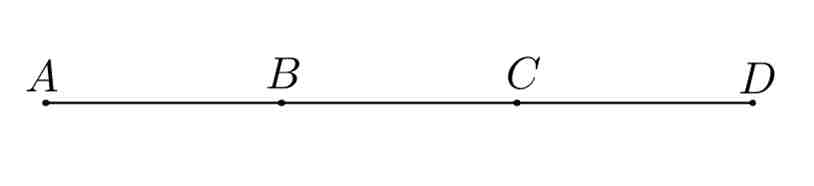
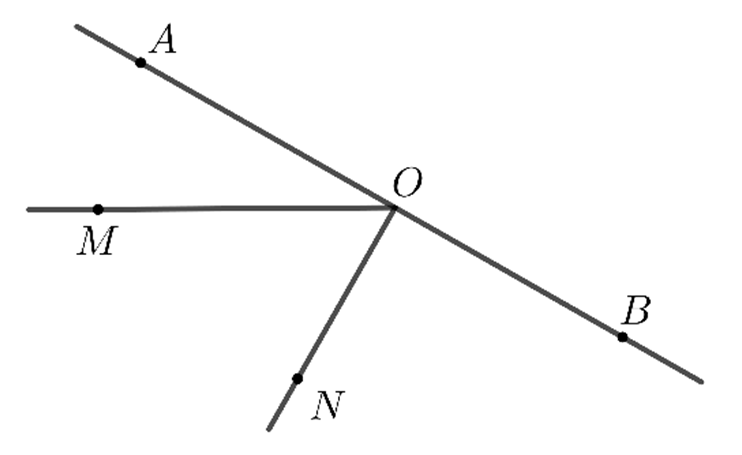
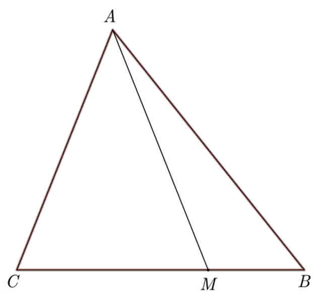
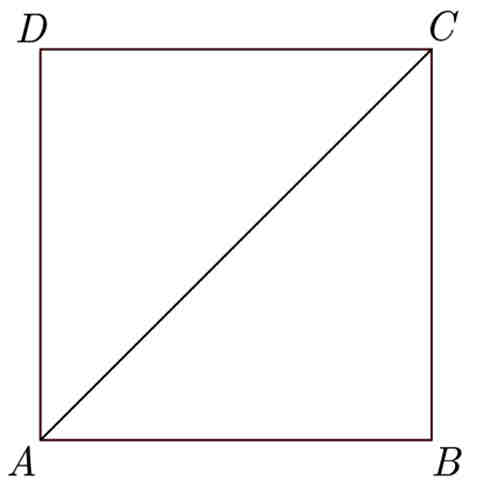
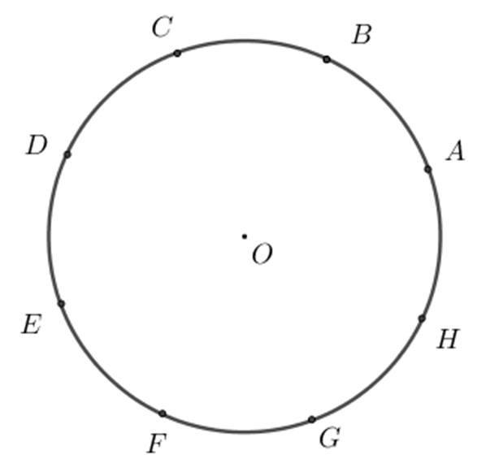
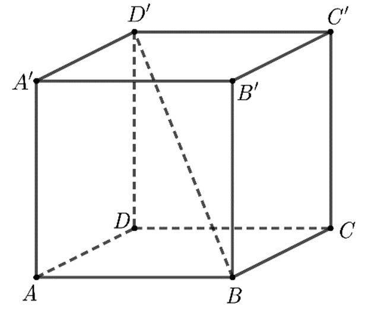
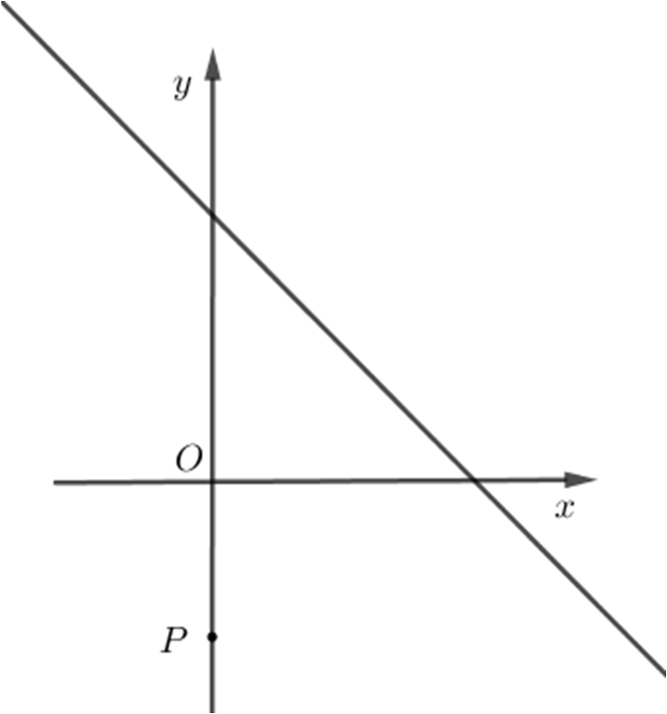
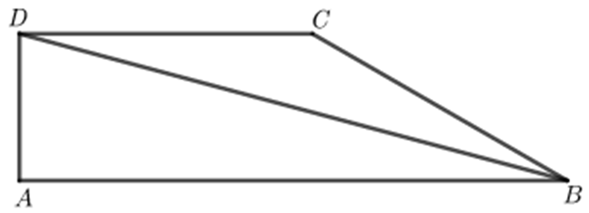
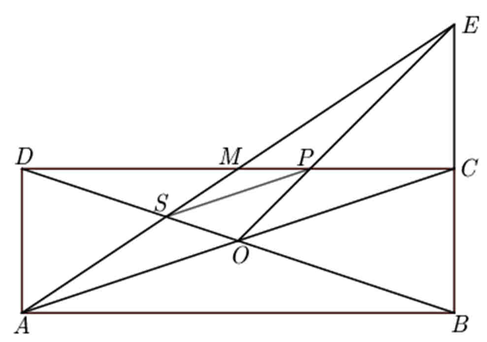
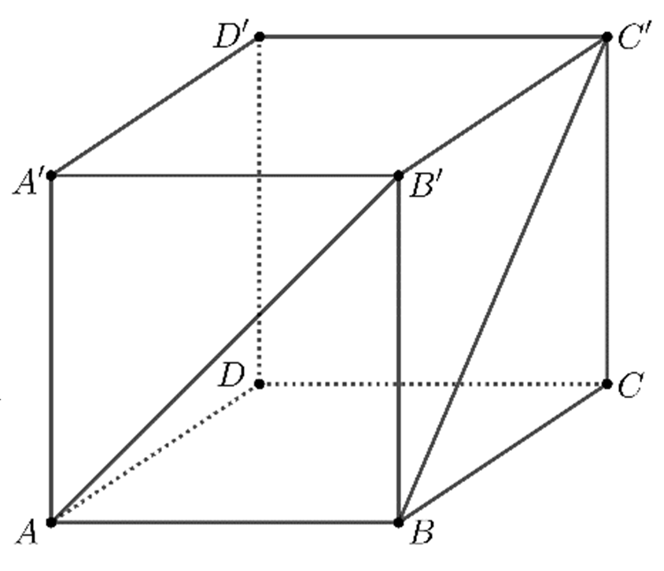

21.06.2023

# Subiectul I

## 1. 5p

Rezultatul calculului $15 - (3 + 4)$ este egal cu:

a. 3
b. 8
c. 16
d. 22

## 2. 5p

Știind că $\frac{x}{y} = \frac{5}{2}$, $y \not = 0$, rezultatul calculului $2x - 5y + 10$ este egal cu:

a. 0
b. 7
c. 10
d. 17

## 3. 5p

Produsul dintre numărul 3 și opusul numărului 3 este egal cu:

a. -9
b. -6
c. 0
d. 1

## 4. 5p

Numărul care reprezintă $\frac{2}{3}$ din 12 este egal cu:

a. 2
b. 4
c. 8
d. 12

## 5. 5p

Profesorul întreabă care este cel mai mare număr întreg din intervalul (2, -5). Răspunsurile date de elevii Andreea, Marina, David și Vlad sunt prezentate în tabelul de mai jos:

$\begin{array}{|c|c|c|c|}
\hline
\text{Andreea} & \text{Marina} & \text{David} & \text{Vlad} \\
\hline
-3 & -2 & 5 & 4 \\
\hline
\end{array}$

Dintre cei patru elevi, cel care a răspun întrebarea profesorului este:

a. Andreea
b. Marina
c. David
d. Vlad

## 6. 5p

În diagrama de mai jos sunt prezentate rezultatele obținute la un test la matematică, de către elevii unei clase a VIII-a. Afirmația: „Conform informațiilor din diagramă, la acest test, nota 7 a fost obținută de 10 elevi.” este:

a. adevărată
b. falsă

# Subiectul II

## 1. 5p

În figura alăturată sunt reprezentate punctele coliniare $A, B, C$ și $D$, în această ordine, astfel încât $AB = BC = CD$, iar lungimea segmentului $AC$ este egală cu $10$ cm. Lungimea segmentului $AD$ este egală cu:

a. 5 cm
b. 10 cm
c. 15 cm
d. 20 cm

## 2. 5p

În figura alăturată sunt reprezentate punctele coliniare $A, O$ și $B$, în această ordine. Punctele $M$ și $N$ sunt de aceeași parte a dreptei $AB$, astfel încât măsura unghiului $MOA$ este egală cu $30^\circ$ și dreapta $ON$ este perpendiculară pe dreapta $AB.$ Măsura unghiului $MON$ este egală cu:

a. $30^\circ$
b. $45^\circ$
c. $60^\circ$
d. $90^\circ$

## 3. 5p

În figura alăturată este reprezentat triunghiul $ABC$ cu aria de 15 cm$^2$. Punctul $M$ se află pe segmentul $BC$, astfel încât $BC = 3 \cdot BM$. Aria triunghiului $AMC$ este egală cu:

a. 5 cm$^2$
b. 7.5 cm$^2$
c. 10 cm$^2$
d. 12.5 cm$^2$

## 4. 5p

În figura alăturată este reprezentat pătratul $ABCD$ cu perimetrul egal cu 40 cm. Lungimea segmentului $AC$ este egală cu:

a. 10 cm
b. $10\sqrt{2}$ cm
c. $10\sqrt{3}$ cm
d. 20 cm

## 5. 5p

În figura alăturată, punctele distincte $A, B, C, D, E, F, G$ și $H$ sunt reprezentate pe cercul de centru $O$, astfel încât arcele mici $AB, BC, CD, DE, EF, FG, GH$ și $HA$ sunt congruente. Măsura arcului mic $BC$ este egală cu:

a. $30^\circ$
b. $45^\circ$
c. $60^\circ$
d. $75^\circ$

## 6. 5p

În figura alăturată este reprezentat cubul $ABCD A'B'C'D'$ cu $AB=5$ cm. Lungimea segmentului $B'D'$ este egală cu:

a. 5 cm
b. $5\sqrt{2}$ cm
c. $5\sqrt{3}$ cm
d. 10 cm

# Subiectul III

## 1. 5p

Maria are 14 ani și tatăl ei are 40 de ani.

### a. 2p

Este posibil ca, peste 2 ani, suma dintre vârsta Mariei și vârsta tatălui ei să fie egală cu 60 de ani? Justifică răspunsul dat.

### b. 3p

Determină peste câți ani vârsta Mariei va fi jumătate din vârsta tatălui ei.

## 2. 5p

Se consideră expresia $E(x) = \left( \frac{1}{(x+1)(x+2)} + \frac{1}{x+2} \right) : \frac{x+3}{5(x+1)}$, unde $x$ este număr real, $x \neq -3$, $x \neq -2$ și $x \neq -1$.

### a. 2p

Arată că $\frac{1}{(x+1)(x+2)} + \frac{1}{x+2} = \frac{1}{x+1}$, pentru orice număr real $x$, $x \neq -2$ și $x \neq -1$.

### b. 3p

Determină suma soluțiilor ecuației $E(x) = \frac{x-3}{8}$, unde $x$ este număr real, $x \neq -3$, $x \neq -2$ și $x \neq -1$.

## 3. 5p

Se consideră funcția $f : \mathbb{R} \rightarrow \mathbb{R}, f(x) = -x + 5$.

### a. 2p

Arată că $f(4) + f(6) = 0$.

### b. 3p

Reprezentarea geometrică a graficului funcției $f$ intersectează axele $Ox$ și $Oy$ ale sistemului de axe ortogonale $xOy$ în punctele $A$, respectiv $B$. Calculează distanța de la punctul $P(0, -3)$ la dreapta $AB$.

## 4. 5p

În figura alăturată este reprezentat trapezul dreptunghic $ABCD$ cu $AB \parallel CD$ și $BC=10$ cm. Semidreapta $BD$ este bisectoarea unghiului $ABC$ și măsura unghiului $ABD$ este egală cu $15^\circ$.

### a. 2p

Determină măsura unghiului $BCD$.

### b. 3p

Arată că $AB - AD < 14$ cm.

## 5. 5p

În figura alăturată este reprezentat dreptunghiul $ABCD$ cu $AB = 9\sqrt{10}$ cm și $AC = 30$ cm. Dreptele $AC$ și $BD$ se intersectează în punctul $O$, iar punctul $M$ este mijlocul segmentului $CD$. Dreptele $BC$ și $AM$ se intersectează în punctul $E$, iar dreptele $OE$ și $CD$ se intersectează în punctul $P$.

### a. 2p

Arată că aria dreptunghiului $ABCD$ este egală cu $270$ cm$^2$.

### b. 3p

Arată că lungimea segmentului $SP$ este egală cu $10$ cm, unde $S$ este punctul de intersecție a dreptelor $AM$ și $BD$.

## 6. 5p

În figura alăturată este reprezentat cubul $ABCD A'B'C'D'$ cu $AB=10$ cm.

### a. 2p

Arată că măsura unghiului dreptelor $AB'$ și $BC'$ este egală cu $60^\circ$.

### b. 3p

Calculează distanța de la punctul $C$ la planul $(BDC')$.
