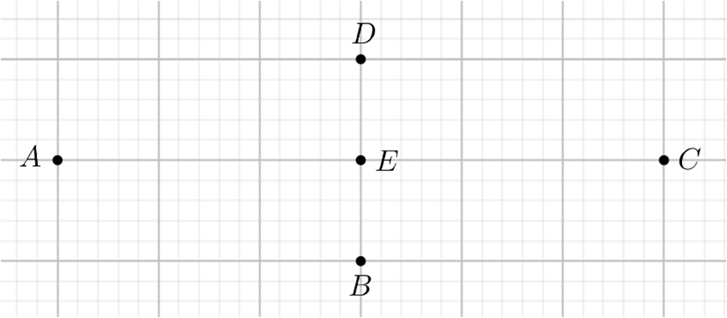

# Subiectul I

## 1. 5p

Rezultatul calculului $2 + 3 \cdot 5$ este egal cu:

a. $1$
b. $10$
c. $17$
d. $25$

## 2. 5p

Dacă $\frac{1}{2} \cdot \frac{a}{3}$, atunci numărul $a$ este egal cu:

a. $\frac{2}{3}$
b. $1$
c. $\frac{3}{2}$
d. $6$

## 3. 5p

Produsul numerelor $-2$ și $7$ este egal cu:

a. $-14$
b. $-5$
c. $5$
d. $14$

## 4. 5p

Scris sub formă de fracție ordinară, numărul $2,3$ este egal cu:

a. $\frac{23}{9}$
b. $\frac{23}{10}$
c. $\frac{2}{3}$
d. $\frac{23}{100}$

## 5. 5p

În tabelul de mai jos sunt prezentate informații referitoare la rezultatele obținute de elevii unei clase la un test de matematică.

$\begin{array}{|c|c|c|c|c|c|c|c|}
\hline
\text{Notă} & 4 & 5 & 6 & 7 & 8 & 9 & 10 \\
\hline
\text{Număr de elevi} & 2 & 1 & 3 & 8 & 6 & 4 & 1 \\
\hline
\end{array}$

Conform informațiilor din tabel, numărul de elevi care au obținut note mai mari sau egale cu 8, la acest test, este egal cu:

a. $5$
b. $6$
c. $11$
d. $14$

## 6. 5p

Se consideră numerele reale $a = 2\sqrt{3}$ și $b = 3\sqrt{2}$. Radu afirmă că: „Numărul $a$ este mai mic decât numărul $b$”. Afirmatia lui Radu este:

a. adevărată
b. falsă

# Subiectul al II-lea

## 1. 5p

În figura alăturată sunt reprezentate punctele $A, B, C, D$ și $E$. Simetricul punctului $B$ față de punctul $E$ este punctul:

a. $A$
b. $B$
c. $C$
d. $D$

## 2. 5p

În figura alăturată sunt reprezentate dreptele paralele $AB$ și $CD$, cu punctele $A$ și $D$ de aceeași parte a dreptei $BC$. Măsura unghiului $BCD$ este egală cu $45^\circ$. Măsura unghiului $ABC$ este egală cu:

a. $45^\circ$
b. $75^\circ$
c. $135^\circ$
d. $145^\circ$

## 3. 5p

În figura alăturată este reprezentat triunghiul echilateral $ABC$, cu lungimea laturii de $12$ cm. Punctul $M$ se află în interiorul triunghiului $ABC$, la distanțe egale de laturile triunghiului. Distanța de la punctul $M$ la dreapta $BC$ este egală cu:

a. $4\sqrt{3}$ cm
b. $6$ cm
c. $4$ cm
d. $2\sqrt{3}$ cm

## 4. 5p

În figura alăturată este reprezentat trapezul $ABCD$ cu $AB \parallel CD$, $CD = 20$ cm și $AB = 4 \cdot CD$. Lungimea liniei mijlocii a acestui trapez este egală cu:

a. $30$ cm
b. $50$ cm
c. $80$ cm
d. $100$ cm

## 5. 5p

În figura alăturată, punctele $A$ și $B$ aparțin cercului de centru $O$. Măsura arcului mic $AB$ este egală cu $46^\circ$. Măsura unghiului $BAO$ este egală cu:

a. $23^\circ$
b. $46^\circ$
c. $67^\circ$
d. $134^\circ$

## 6. 5p

În figura alăturată este reprezentat un tetraedru regulat $ABCD$ cu $AB = 6$ cm. Suma lungimilor tuturor muchiilor acestui tetraedru este egală cu:

a. $18$ cm
b. $24$ cm
c. $30$ cm
d. $36$ cm

# Subiectul al III-lea

## 1. 5p

La ora de geometrie, fiecare dintre cei 25 de elevi ai unei clase a desenat pe caiet fie un triunghi, fie un patrulater.

### a. 2p

Este posibil ca exact 7 elevi să fi desenat câte un triunghi și numărul total de laturi desenate de cei 25 de elevi să fie egal cu 90? Justifică răspunsul dat.

### b. 3p

Determină numărul de elevi care au desenat câte un patrulater, știind că numărul total de laturi ale figurilor geometrice desenate de elevii clasei este egal cu 91.

## 2. 5p

Se consideră expresia $ E(x) = \left( \frac{1}{x} + \frac{2}{x+1} + \frac{3}{x+2} \right) : \frac{2x+1}{x^2 + 3x + 2} $, unde $ x $ este număr real, $ x \neq 0 $, $ x \neq -1 $, $ x \neq -2 $, $ x \neq - \frac{1}{2} $.

### a. 2p

Arată că $ x^2 + 3x + 2 = (x+1)(x+2) $, pentru orice număr real $ x $.

### b. 3p

Dacă $ n $ este număr natural par, nenul, arată că numărul $ N = \frac{1}{E(n)} $ este natural.

## 3. 5p

Se consideră funcția $ f : \mathbb{R} \rightarrow \mathbb{R}, f(x) = \frac{x}{3} - 1 $.

### a. 2p

Arată că $ f(3) + f(9) = 2 $.

### b. 3p

Reprezentarea geometrică a graficului funcției $ f $ intersectează axele $ Ox $ și $ Oy $ ale sistemului de axe ortogonale $ xOy $ în punctele $ M $, respectiv $ N $. Calculează distanța de la punctul $ O $ la reprezentarea geometrică a graficului funcției $ f $.

## 4. 5p

În figura alăturată sunt reprezentate triunghiurile echilaterale $ABC$ și $CDE$, cu $AB = 8$cm, $CD = 4$cm, iar punctele $B, C$ și $D$ sunt coliniare, în această ordine. Punctele $M$ și $N$ sunt mijloacele segmentelor $AB$, respectiv $DE$.

### a. 2p

Arată că $CM = 2 \cdot CN$.

### b. 3p

Aria triunghiului $MCN$ reprezintă $p\%$ din aria triunghiului $ACD$. Determină valoarea lui $p$.

## 5. 5p

În figura alăturată este reprezentat triunghiul $ABC$, cu $AB = AC = 10$ cm și $\angle BAC = 120^\circ$. Punctul $M$ este mijlocul segmentului $BC$ și punctul $S$ este simetricul punctului $M$ față de punctul $A$.

### a. 2p

Arată că $BC = 10\sqrt{3}$ cm.

### b. 3p

Demonstrează că distanța de la punctul $M$ la dreapta $SC$ este mai mică decât $7$ cm.

## 6. 5p

În figura alăturată este reprezentat paralelipipedul dreptunghic $ABCD A'B'C'D'$, cu $AB = 2\sqrt{3}$ cm, $BC = 2$ cm și $AA' = 4$ cm. Punctul $M$ este mijlocul segmentului $BC$.

### a. 2p

Arată că volumul paralelipipedului dreptunghic $ABCD A'B'C'D'$ este egal cu $16\sqrt{3}$ cm³.

### b. 3p

Demonstrează că dreapta $A'C$ este paralelă cu planul $(MAB')$.
