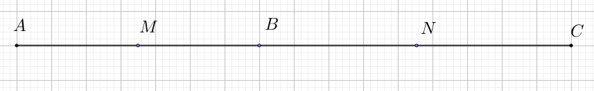
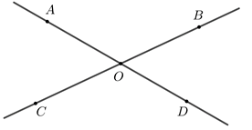
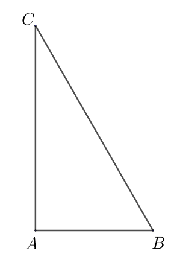
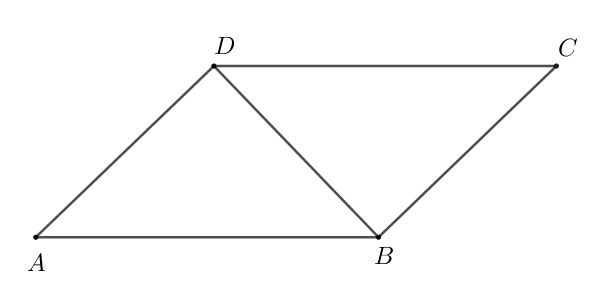
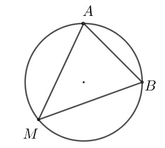

# Subiectul I

## 1. 5p

Rezultatul calculului $64 - 56 : 8$ este egal cu:

a. $0$
b. $1$
c. $56$
d. $57$

## 2. 5p

Știind că $\frac{a}{3} = \frac{b}{4}$, atunci rezultatul calculului $4a - 3b$ este egal cu:

a. $0$
b. $1$
c. $7$
d. $12$

## 3. 5p

Suma numerelor întregi din intervalul $[-2022, 2022]$ este egală cu:

a. $-2022$
b. $-2021$
c. $0$
d. $2022$

## 4. 5p

În tabelul de mai jos este prezentată situația notelor obținute de elevii claselor a VIII-a dintr-o școală, la un test de matematică:

$\begin{array}{|c|c|c|c|c|c|c|}
\hline
\text{Notă} & 5 & 6 & 7 & 8 & 9 & 10 \\
\hline
\text{Numărul elevilor} & 6 & 9 & 12 & 15 & 12 & 6 \\
\hline
\end{array}$

Media notelor obținute de elevii claselor a VIII-a din această școală la testul de matematică este egală cu:

a. $6,00$
b. $7,60$
c. $7,90$
d. $8,60$

## 5. 5p

Patru elevi, Ioana, Mara, Petrică și Ștefan, au calculat produsul numerelor $a = \left|\sqrt{2} - \sqrt{3}\right|$ și $b = \left|\sqrt{3} + \sqrt{2}\right|$, iar rezultatele obținute sunt prezentate în tabelul de mai jos:

$\begin{array}{|c|c|c|c|}
\hline
\text{Ioana} & \text{Mara} & \text{Petrică} & \text{Ștefan} \\
\hline
-1 & 5 - 2\sqrt{6} & 1 & 5 + 2\sqrt{6} \\
\hline
\end{array}$

Conform informațiilor din tabel, rezultatul corect a fost obținut de:

a. Ioana
b. Mara
c. Petrică
d. Ștefan

## 6. 5p

O mașină se deplasează în intervalul orar 12:56 – 14:26 cu o viteză medie de 80 km/h. Mihai afirmă că, în acest interval de timp, mașina a parcurs o distanță egală cu 200 km. Afirmatia lui Mihai este:

a. adevărată
b. falsă

# Subiectul al II-lea

## 1. 5p

În figura alăturată punctele $A, B$ și $C$ sunt coliniare, în această ordine, astfel încât $AB = 7$ cm și $BC = 9$ cm. Știind că punctul $M$ este mijlocul segmentului $AB$, iar punctul $N$ este mijlocul segmentului $BC$, lungimea segmentului $MN$ este egală cu:

 size=40

a. $8$ cm
b. $11,5$ cm
c. $12,5$ cm
d. $16$ cm

## 2. 5p

În figura alăturată sunt reprezentate unghiurile opuse la vârf $AOC$ și $BOD$. Măsura unghiului $AOB$ este egală cu $120^\circ$. Măsura unghiului $BOD$ este egală cu:

a. $30^\circ$
b. $60^\circ$
c. $90^\circ$
d. $120^\circ$

## 3. 5p

În figura alăturată este reprezentat triunghiul $ABC$, dreptunghic în $A$, cu $BC = 6$ cm și măsura unghiului $B$ este egală cu $60^\circ$. Lungimea segmentului $AB$ este egală cu:

a. $2\sqrt{3}$ cm
b. $3$ cm
c. $3\sqrt{2}$ cm
d. $3\sqrt{3}$ cm

## 4. 5p

În figura alăturată este reprezentat paralelogramul $ABCD$, cu $AD = BD$ și măsura unghiului $DAB$ este egală cu $45^\circ$. Măsura unghiului $CBD$ este egală cu:

a. $135^\circ$
b. $90^\circ$
c. $60^\circ$
d. $45^\circ$

## 5. 5p

În figura alăturată este reprezentat triunghiul $AMB$, cu $AB = 8\sqrt{2}$ cm, înscris într-un cerc care are raza egală cu $8$ cm. Măsura unghiului $AMB$ este egală cu:

a. $15^\circ$
b. $30^\circ$
c. $45^\circ$
d. $60^\circ$

## 6. 5p

În figura alăturată este reprezentat un con circular drept care are secțiunea axială un triunghi echilateral cu înălțimea egală cu $6$ cm. Generatoarea conului are lungimea egală cu:

a. $2\sqrt{3}$ cm
b. $4\sqrt{3}$ cm
c. $6$ cm
d. $12$ cm

# Subiectul al III-lea

## 1. 5p

Un excursionist a parcurs un traseu în trei zile. În prima zi a parcurs 30% din lungimea traseului, în a doua zi o treime din distanța parcursă în prima zi, iar în a treia zi a parcurs restul de 72 km.

### a. 2p

Este posibil ca distanța parcursă de excursionist în a doua zi să reprezinte o pătrime din lungimea întregului traseu? Justifică răspunsul dat.

### b. 3p

Determină lungimea traseului parcurs de excursionist în cele trei zile.

## 2. 5p

Se consideră expresia $E(x) = \left( \frac{2}{x - 2} + \frac{x}{x+2} \right) : \frac{x^2 + 4}{x^2 - x - 2}$, unde $x \in \mathbb{R} \setminus \{-2, -1, 2\}$.

### a. 2p

Arată că $E(x) = \frac{x + 1}{x + 2}$, pentru orice $x \in \mathbb{R} \setminus \{-2, -1, 2\}$.

### b. 3p

Determină numerele întregi $a$ pentru care $E(a) \in \mathbb{Z}$.

## 3. 5p

Se consideră funcția $f : \mathbb{R} \rightarrow \mathbb{R}, f(x) = x + 2$.

### a. 2p

Rezolvă ecuația $3 \cdot f(x) = -4 - 2x$.

### b. 3p

Știind că $A$ și $B$ sunt punctele de intersecție a reprezentării grafice a funcției $f$ cu axele $Ox$ respectiv $Oy$ ale sistemului de axe ortogonale $xOy$, iar punctul $C$ este simetricul punctului $A$ față de punctul $B$, determină coordonatele punctului $C$.

## 4. 5p

În figura alăturată este reprezentat pătratul $ABCD$ cu $AB = 4$ cm și triunghiul echilateral $ABP$.

### a. 2p

Arată că măsura unghiului $DPB$ este egală cu $45^\circ$.

### b. 3p

Demonstrează că $AM = 4(2 - \sqrt{3})$ cm, unde $\{M\} = AB \cap PD$.

## 5. 5p

În figura alăturată este reprezentat trapezul $ABCD$ cu $AB \parallel CD$, $AB = 6$ cm și $CD = 4$ cm. Punctele $R, S$ și $T$ sunt mijloacele laturilor $AD$, $AB$, respectiv $BC$.

### a. 2p

Arată că lungimea segmentului $RT$ este egală cu $5$ cm.

### b. 3p

Arată că aria patrulaterului $DRST$ este egală cu jumătate din aria trapezului $ABCD$.

## 6. 5p

În figura alăturată este reprezentat cubul $ABCD A'B'C'D'$ cu $D'C' = 6$ cm.

### a. 2p

Arată că volumul cubului $ABCD A'B'C'D'$ este egal cu $216$ cm³.

### b. 3p

Demonstrează că dreapta $OO'$ este perpendiculară pe planul $(A'D'C)$, unde $\{O\} = AC \cap BD$ și $\{O'\} = BC' \cap B'C$.
