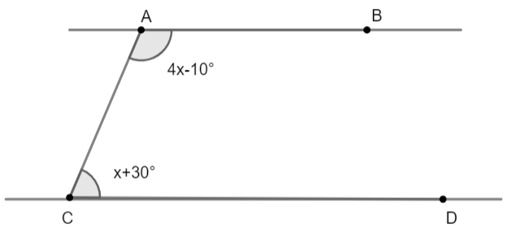
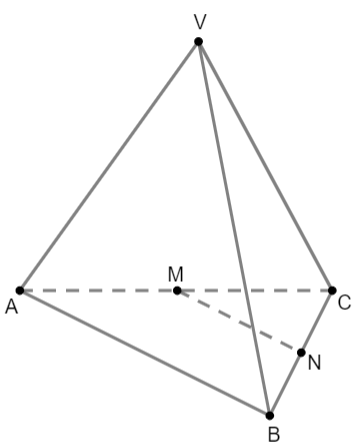

# Subiectul I

## 1. 5p

Rezultatul calculului $11 - 11 \cdot (8 - 16 : 2)$ este egal cu:

a. $11$
b. $0$
c. $6$
d. $10$

## 2. 5p

Numărul care reprezintă $\frac{5}{6}$ din $1200$ este egal cu:

a. $200$
b. $100$
c. $1000$
d. $6000$

## 3. 5p

În tabelul de mai jos sunt prezentate temperaturile înregistrate la ora 9, la o stație meteo, în fiecare zi a unei săptămâni din luna ianuarie.

$\begin{array}{|c|c|c|c|c|c|c|c|}
\hline
\text{Ziua} & \text{Luni} & \text{Marți} & \text{Miercuri} & \text{Joi} & \text{Vineri} & \text{Sâmbătă} & \text{Duminică} \\
\hline
\text{Temperatura (}^\circ C\text{)} & -5 & -4 & 3 & 1 & -1 & -3 & 2 \\
\hline
\end{array}$

Conform tabelului, media aritmetică a temperaturilor pozitive înregistrate este egală cu:

a. $1^\circ C$
b. $-2^\circ C$
c. $-1^\circ C$
d. $2^\circ C$

## 4. 5p

Numărul $3\sqrt{2}$ aparține intervalului de numere reale:

a. $(2, 3)$
b. $(4, 5)$
c. $[5, 6)$
d. $[3, 4]$

## 5. 5p

Patru elevi au calculat media geometrică a numerelor $a = 12 - 3\sqrt{7}$ și $b = 3(4 + \sqrt{7})$.
Rezultatele obținute sunt prezentate în tabelul de mai jos.

$\begin{array}{|c|c|c|c|}
\hline
\text{Alexandra} & \text{Violeta} & \text{Crina} & \text{Diana} \\
\hline
81 & 12 & 9 & 24 + 6\sqrt{7} \\
\hline
\end{array}$

Dintre cei patru elevi, cel care a calculat corect media geometrică este:

a. Alexandra
b. Violeta
c. Crina
d. Diana

## 6. 5p

Sebastian are $180$ de lei, iar Adrian, colegul lui, are $120$ de lei. Adrian afirmă: „Dacă i-aș da lui Sebastian o șesime din banii mei, atunci suma mea de bani ar fi jumătate din suma lui”. Afirmația lui Adrian este:

a. adevărată
b. falsă

# Subiectul al II-lea

## 1. 5p

În figura alăturată, $A, B, C$ și $D$ sunt puncte coliniare, în această ordine, astfel încât $B$ este mijlocul segmentului $AC$, $2BC = CD$ și $BD = 9$ cm. Lungimea segmentului $AD$ este egală cu:

 size=40

a. $16$ cm
b. $12$ cm
c. $18$ cm
d. $10$ cm

## 2. 5p

În figura alăturată sunt reprezentate dreptele paralele $AB$ și $CD$, iar unghiurile $BAC$ și $DCA$ au măsurile indicate pe figură. Atunci măsura unghiului $ACD$ este egală cu:

 size=30

a. $32^\circ$
b. $64^\circ$
c. $62^\circ$
d. $45^\circ$

## 3. 5p

În figura alăturată este reprezentat triunghiul $ABC$ cu $AB = AC = 6$ cm și cu măsura unghiului $ABC$ egală cu $15^\circ$. Distanța de la punctul $B$ la dreapta $AC$ este egală cu:

 size=30

a. $3$ cm
b. $6$ cm
c. $8$ cm
d. $12$ cm

## 4. 5p

În figura alăturată este reprezentat paralelogramul $ABCD$, cu $AB = 10$ cm, $AD = 6$ cm și măsura unghiului $DAB$ egală cu $60^\circ$. Aria paralelogramului $ABCD$ este egală cu:

 size=30

a. $30$ cm$^2$
b. $40$ cm$^2$
c. $30\sqrt{3}$ cm$^2$
d. $15\sqrt{3}$ cm$^2$

## 5. 5p

În figura alăturată sunt reprezentate două coarde perpendiculare $AB$ și $AC$ ale unui cerc de centru $O$, $AB = 6$ cm și $AC = 8$ cm. Lungimea acestui cerc este egală cu:

a. $10\pi$ cm
b. $16\pi$ cm
c. $12\pi$ cm
d. $24\pi$ cm

## 6. 5p

În figura alăturată, $VABC$ este o piramidă triunghiulară regulată cu baza $ABC$. Dacă triunghiul $VAB$ este echilateral și $MN = 4$ cm, unde $M$ este mijlocul lui $AC$ și $N$ este mijlocul lui $BC$, atunci suma lungimilor tuturor muchiilor piramidei este egală cu:

a. $36$ cm
b. $24$ cm
c. $32$ cm
d. $48$ cm

# Subiectul al III-lea

## 1. 5p

Numărul elevilor claselor a 9-a ai unui colegiu militar este cuprins între $100$ și $200$.
Dacă elevii s-ar alinia în grupe de câte $12$, $18$, respectiv $24$, ar rămâne de fiecare dată $5$ elevi.

### a. 2p

Este posibil ca numărul de elevi să fie egal cu $161$? Justifică răspunsul.

### b. 3p

Determină numărul elevilor claselor a 9-a ai colegiului militar.

## 2. 5p

Se consideră expresia $E(x) = x(2x - 5) + (x + 5)^2 - (x + 2)^2 - (3 + x)(x - 3) - 30$, unde $x$ este număr real.

### a. 2p

Arată că $E(x) = x^2 + x$, pentru orice număr real $x$.

### b. 3p

Arată că $E(n)$ este număr par pentru orice număr natural $n$.

## 3. 5p

Se consideră numerele reale $a = {\frac{\sqrt{24}}{\sqrt{32} - 4 \cdot \left(\sqrt{2} - \sqrt{18}\right)}} \cdot \sqrt{3}$ și $b = \frac{1}{1 \cdot 2} + \frac{1}{2 \cdot 3} + \frac{1}{3 \cdot 4} + \frac{1}{4 \cdot 5}$

### a. 2p

Arată că $a = \frac{1}{2}$

### b. 3p

Arată că numărul $N = 2(a + b)$ aparține intervalului $\left(2, \sqrt{7}\right)$.

## 4. 5p

În figura alăturată este reprezentat triunghiul $ABC$ dreptunghic în $A$ cu $AB = 16$ cm, $AC = 12$ cm, punctele $E$ și $F$ sunt situate pe segmentele $AB$ și $AC$, astfel încât $AE = 6$ cm și $AF = 8$ cm.

### a. 2p

Arată că perimetrul triunghiului $ABC$ este egal cu $48$ cm.

### b. 3p

Perpendiculara din $A$ pe $BC$ intersectează dreapta $EF$ în punctul $P$. Demonstrează că punctul $P$ este mijlocul segmentului $EF$.

## 5. 5p

În figura alăturată este reprezentat dreptunghiul $ABCD$ cu $AD = 4$ cm și $DB = 8$ cm. Bisectoarea unghiului $ABC$ intersectează diagonala $AC$ în $P$ și latura $DC$ în $E$.

### a. 2p

Arată că aria dreptunghiului $ABCD$ este egală cu $16\sqrt{3}$ cm$^2$.

### b. 3p

Demonstrează că triunghiul $POE$ este isoscel.

## 6. 5p

În figura alăturată este reprezentat un tetraedru regulat $ABCD$ cu $AB = 12$ cm, unde $O$ este centrul cercului circumscris triunghiului $BCD$. Punctele $M$ și $N$ sunt mijloacele segmentelor $CD$, respectiv $AC$. Punctul $P$ aparține segmentului $BC$, astfel încât $BP = 3PC$.

### a. 2p

Arată că aria triunghiului $BCD$ este egală cu $36\sqrt{3}$ cm$^2$.

### b. 3p

Demonstrează că planele $(MNP)$ și $(AOD)$ sunt paralele.
