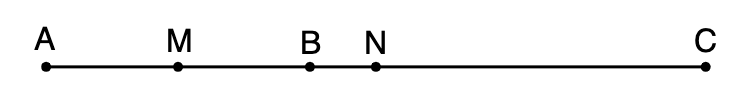
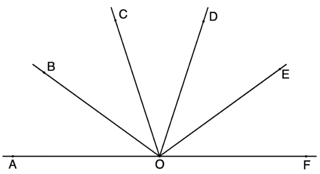
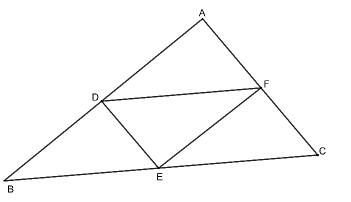
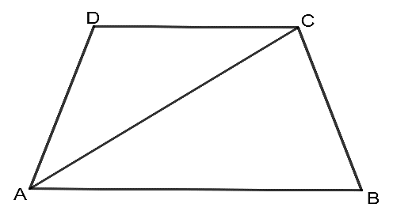
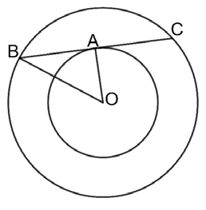
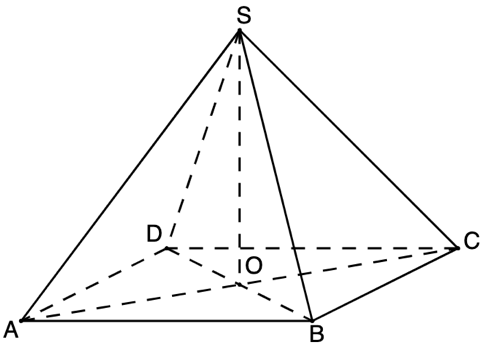
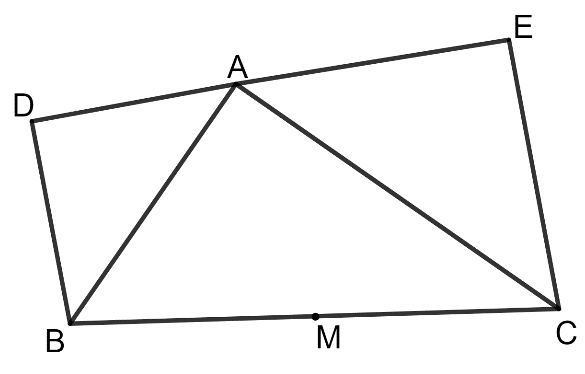
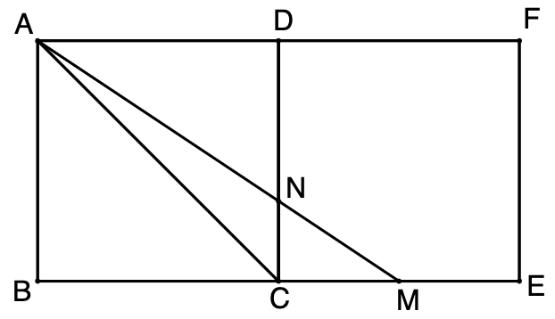
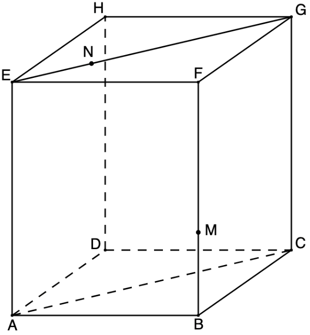

# Subiectul I

## 1. 5p

Rezultatul calculului $40 - 2 \cdot 3^2$ este:

a. $4$
b. $22$
c. $342$
d. $28$

## 2. 5p

Numărul întreg $x$ care verifică ecuația $2^{x-6} = 1$ este:

a. $0$
b. $-6$
c. $6$
d. $2$

## 3. 5p

Suma numerelor naturale prime, mai mici decât $10$, este:

a. $25$
b. $18$
c. $17$
d. $12$

## 4. 5p

Ordinea crescătoare a numerelor $x = -3\sqrt{5}, y = -5\sqrt{3} \text{ și } z = -2\sqrt{15}$ este:

a. $y; z; x$
b. $x; y; z$
c. $x; z; y$
d. $z; y; x$

## 5. 5p

Calculând $15\%$ din $420$ se obține:

a. $60$
b. $42$
c. $62$
d. $63$

## 6. 5p

Andrei afirmă că valoarea absolută a numărului $-8,2$ este $8,2$. Afirmația lui Andrei este:

a. adevărată
b. falsă

# Subiectul al II-lea

## 1. 5p

În figura alăturată, punctele $A, B \text{ și } C$ sunt coliniare în această ordine, astfel încât $AB = 2 \text{ cm} \text{ și } BC = 3 \text{ cm}$. Punctele $M \text{ și } N$ sunt mijloacele segmentelor $AB$, respectiv $AC$. Lungimea segmentului $MN$ este egală cu:

a. $0,5 \text{ cm}$
b. $1 \text{ cm}$
c. $1,5 \text{ cm}$
d. $2 \text{ cm}$

## 2. 5p

În figura alăturată, unghiurile $AOB, BOC, COD, DOE \text{ și } EOF$ sunt congruente, astfel încât punctele $A, O \text{ și } F$ sunt coliniare. Măsura unghiului $BOD$ este egală cu:

a. $90^\circ$
b. $72^\circ$
c. $36^\circ$
d. $30^\circ$

## 3. 5p

Punctele $D, E \text{ și } F$ sunt mijloacele laturilor triunghiului $ABC$ cu perimetrul egal cu $36 \text{ cm}$. Perimetrul triunghiului $DEF$ este egal cu:

 size=30

a. $12 \text{ cm}$
b. $16 \text{ cm}$
c. $24 \text{ cm}$
d. $18 \text{ cm}$

## 4. 5p

Trapezul $ABCD$ are baza mare $AB$ egală cu diagonala $AC$ și $AD=DC=CB$. Măsura unghiului $ABC$ este egală cu:

a. $60^\circ$
b. $75^\circ$
c. $36^\circ$
d. $72^\circ$

## 5. 5p

În figura alăturată sunt reprezentate două cercuri concentrice de centru $O$ și raze $OA$ și $OB$. Coarda $BC$ este tangentă în punctul $A$ la cercul mai mic. Știind că $OA = 6 \text{ cm}$ și $OB=10 \text{ cm}$, lungimea segmentului $BC$ este egală cu:

a. $4\sqrt{34} \text{ cm}$
b. $8\sqrt{3} \text{ cm}$
c. $16 \text{ cm}$
d. $10\sqrt{2} \text{ cm}$

## 6. 5p

Piramida patrulateră regulată $SABCD$ are toate muchiile congruente. Măsura unghiului dintre dreptele $SA$ și $BC$ este de:

a. $30^\circ$
b. $60^\circ$
c. $90^\circ$
d. $120^\circ$

# Subiectul al III-lea

## 1. 5p

Media aritmetică a două numere naturale este $25$. Împărțind un număr la celălalt, se obține câtul $11$ și restul egal cu $2$.

### a. 2p

Poate fi numărul mai mare egal cu $45$? Justificați răspunsul.

### b. 3p

Aflați cele două numere.

## 2. 5p

Fie numărul $a = \frac{2}{3\sqrt{5}} - \frac{\sqrt{5}-1}{\sqrt{5}} - (\sqrt{1,8})^{-1}$.

### a. 2p

Arătați că $a = -1$.

### b. 3p

Dacă $b = 2\sqrt{3} - 5$, calculați $(6a - b + 2\sqrt{3})^{2023}$.

## 3. 5p

Fie $E(x)=\left( \frac{x-6}{x^2-25} + \frac{x}{x-5} - \frac{2}{x + 5} \right) : \frac{2x+4}{x^2-25}$, $x \in \mathbb{R} \backslash \{-5; -2; 5\}$

### a. 2p

Arătați că $E(x)=\frac{x+2}{2}$.

### b. 3p

Rezolvați în mulțimea numerelor întregi ecuația $|4 \cdot E(x) - 5| = 5$.

## 4. 5p

În exteriorul triunghiului dreptunghic $ABC$, cu catetele $AB=12 \text{ cm}$ și $AC=16 \text{ cm}$, se construiesc triunghiurile dreptunghice isoscele $ABD$ și $ACE$ cu ipotenuzele $AB$ și respectiv $AC$.

### a. 2p

Arătați că punctele $D, A \text{ și } E$ sunt puncte coliniare.

### b. 3p

Dacă $M$ este mijlocul laturii $BC$, $DM \cap AB = \{P\}$ și $EM \cap AC = \{Q\}$, calculați aria patrulaterului $APMQ$.

## 5. 5p

În figura alăturată sunt reprezentate două pătrate, $ABCD$ și $CDFE$, având laturile de $18 \text{ cm}$. Punctul $M$ este mijlocul lui $CE$, iar $AM \cap CD = \{N\}$.

### a. 2p

Arătați că $NC = 6 \text{ cm}$.

### b. 3p

Calculați sinusul unghiului $CAM$.

## 6. 5p

În figura alăturată este reprezentat un paralelipiped dreptunghic $ABCDEFGH$ cu $AB = 20 \text{ cm}$, $BC = 15 \text{ cm}$ și $ACGE$ este pătrat.

### a. 2p

Arătați că $AE = 25 \text{ cm}$.

### b. 3p

Punctele $M$ și $N$ aparțin segmentelor $BF$ și respectiv $EG$, astfel încât $BM = EN = 5 \text{ cm}$. Calculați tangenta unghiului format de dreapta $MN$ cu planul $(BFC)$.
