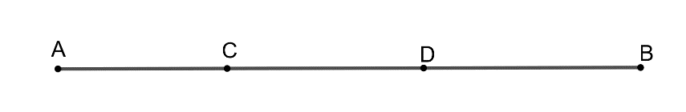
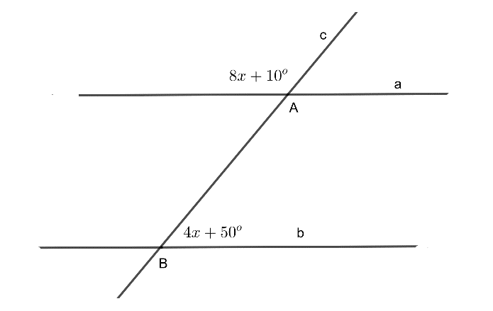
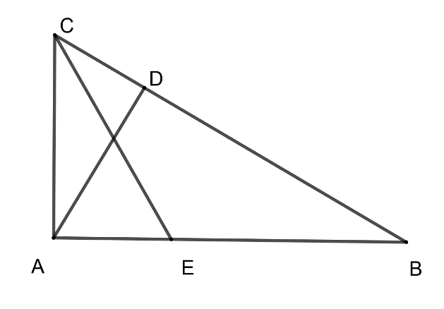
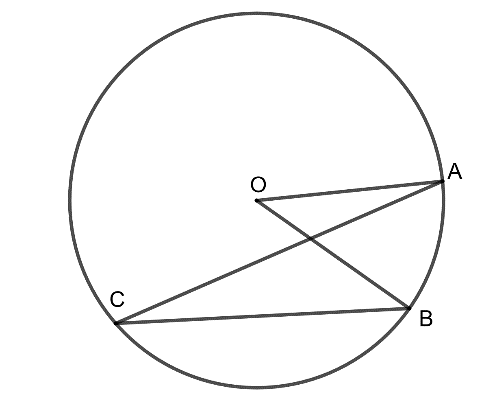
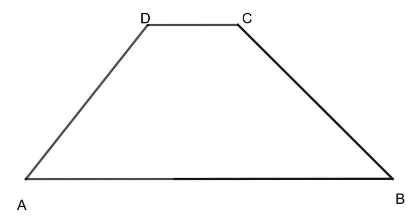
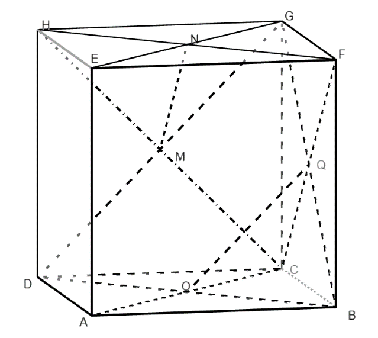
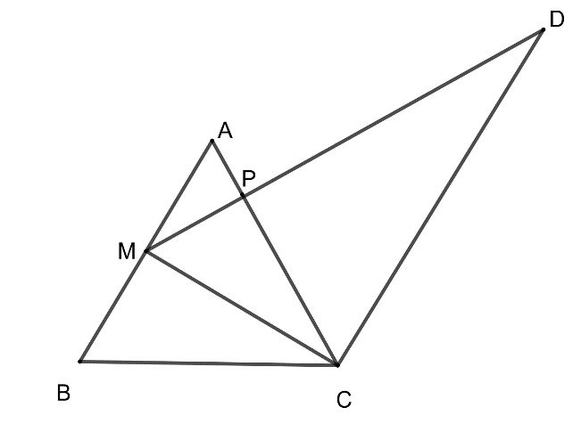
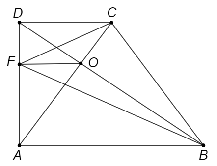
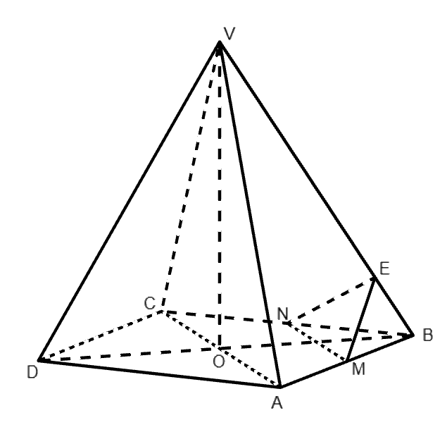

# Subiectul I

## 1. 5p

Rezultatul calculului $30 - 10 : 2$ este egal cu:

a. $10$
b. $25$
c. $15$
d. $20$

## 2. 5p

Dacă $\frac{a}{b} = \frac{2}{5}$, atunci $\frac{3a+2b}{7a-2b}$ este egal cu:

a. $4$
b. $2$
c. $\frac{1}{2}$
d. $1$

## 3. 5p

Probabilitatea ca, alegând la întâmplare un element al mulțimii $A = \{0, 1, 2, 3, 4, 5, 6, 7, 8, 9\}$, acesta să fie număr prim este egală cu:

a. $\frac{3}{5}$
b. $\frac{3}{10}$
c. $\frac{2}{5}$
d. $\frac{1}{2}$

## 4. 5p

În tabelul de mai jos este prezentată situația notelor obținute de elevii clasei a VIII-a dintr-o școală, la un test la matematică:

$\begin{array}{|c|c|c|c|c|c|c|}
\hline
\text{Notă} & 5 & 6 & 7 & 8 & 9 & 10 \\
\hline
\text{Numărul elevilor} & 9 & 11 & 16 & 13 & 7 & 4 \\
\hline
\end{array}$

Procentul elevilor care au obținut note mai mari decât 7 din numărul total de elevi este egal cu:

a. $20\%$
b. $25\%$
c. $30\%$
d. $40\%$

## 5. 5p

Patru elevi, Maria, Cristina, Ștefan și Mihai, au calculat media geometrică a numerelor $a = 9 - 3\sqrt{5}$ și $b = 9 + 3\sqrt{5}$. Rezultatele obținute de elevi sunt prezentate în tabelul de mai jos:

$\begin{array}{|c|c|c|c|}
\hline
\text{Maria} & \text{Cristina} & \text{Ștefan} & \text{Mihai} \\
\hline
36 & 6 & 9 & 3\sqrt{5} \\
\hline
\end{array}$

Dintre cei patru elevi, rezultatul corect a fost obținut de:

a. Maria
b. Cristina
c. Ștefan
d. Mihai

## 6. 5p

Afirmatia „Numărul $2\sqrt{3}$ aparține intervalului $(3; 4)$” este:

a. adevărată
b. falsă

# Subiectul al II-lea

## 1. 5p

În figura alăturată punctele A, C, D și B sunt coliniare, în această ordine, astfel încât $AB = 5 \cdot AC$, $2 \cdot AB = 5 \cdot BD$. Dacă $AC = 2$ cm, atunci lungimea segmentului CD este egală cu:

a. $4$ cm
b. $6$ cm
c. $3$ cm
d. $5$ cm

## 2. 5p

În figura următoare, dreptele $a$ și $b$ sunt paralele și sunt intersectate de secanta $c$, fiind evidențiate măsurile a două unghiuri de $8x + 10^\circ$ și respectiv $4x + 50^\circ$. Valoarea lui $x$ este egală cu:

a. $10^\circ$
b. $20^\circ$
c. $30^\circ$
d. $40^\circ$

## 3. 5p

Fie triunghiul $ABC$ dreptunghic în $A$ și $AD \perp BC$, $D \in BC$. Dacă $AD=12$ cm, măsura unghiului $ABC$ este egală cu $30^\circ$, iar $[CE$ este bisectoarea unghiului $ACB$, atunci lungimea segmentului $CE$ este egală cu:

a. $24$ cm
b. $12$ cm
c. $16$ cm
d. $12\sqrt{3}$ cm

## 4. 5p

În cercul de centru $O$ din figura alăturată măsura unghiului $AOB$ este egală cu $40^\circ$, iar $C$ este un punct pe acest cerc. Atunci măsura unghiului $ACB$ este egală cu:

a. $40^\circ$
b. $50^\circ$
c. $30^\circ$
d. $20^\circ$

## 5. 5p

În figura alăturată este reprezentat trapezul isoscel $ABCD$ cu $AB \parallel CD$, $AB = 14$ cm, $CD = 6$ cm, iar măsura unghiului $ABC$ este egală cu $45^\circ$. Aria trapezului $ABCD$ este egală cu:

a. $40$ cm$^2$
b. $84$ cm$^2$
c. $42$ cm$^2$
d. $40\sqrt{2}$ cm$^2$

## 6. 5p

În figura alăturată este reprezentat cubul $ABCDEFGH$. Dacă punctele $O, Q, M, N$ reprezintă centrele fețelor $ABCD$, $BCGF$, $CDHG$, respectiv $EFGH$, atunci măsura unghiului determinat de dreptele $OQ$ și $MN$ este egală cu:

a. $30^\circ$
b. $45^\circ$
c. $60^\circ$
d. $90^\circ$

# Subiectul al III-lea

## 1. 5p

Matei și Vlad sunt frați. Suma vârstelor lor este 21 ani, iar în urmă cu 3 ani, vârsta lui Matei era jumătate din vârsta lui Vlad.

### a. 2p

Este posibil ca Vlad să aibă în prezent 8 ani? Justifică răspunsul dat.

### b. 3p

Determină peste câți ani vârsta lui Matei va fi două treimi din vârsta lui Vlad.

## 2. 5p

Se consideră expresia $E(x) = (2x + 1)^2 - (x - 1)^2 + (x - 2)(x + 2) - 3x^2 + 14$.

### a. 2p

Arată că $E(x) = x^2 + 6x + 10$, oricare ar fi numărul real $x$.

### b. 3p

Arată că $E(x) \geq 0$, pentru orice număr real $x$.

## 3. 5p

Se consideră numerele reale: $a = \left(\sqrt{0, (3)} - \frac{2\sqrt{3}}{3}\right) \cdot \sqrt{3} - \left(\sqrt{0, (2)} - \frac{4}{3\sqrt{2}}\right) \cdot \sqrt{18}$ și $b = \left(\sqrt{0, (6)} + \frac{2\sqrt{6}}{3}\right) \cdot \sqrt{6} - \left(\sqrt{0, (3)} + \frac{2}{\sqrt{3}}\right) \cdot \sqrt{3}$.

### a. 2p

Arată că $a = 1$.

### b. 3p

Arată că dacă $x = \sqrt{a + b}$, atunci $x$ este număr natural.

## 4. 5p

În figura alăturată este reprezentat triunghiul echilateral $ABC$ cu $AB = 8$ cm. Notăm cu $M$ mijlocul laturii $AB$ și construim din $M$ perpendiculara pe $AC$ care intersectează pe $AC$ în $P$ și paralela prin $C$ la $AB$ în $D$.

### a. 2p

Arată că lungimea segmentului $CD$ este egală cu $12$ cm.

### b. 3p

Arată că aria patrulaterului $AMCD$ este dublul ariei triunghiului $ABC$.

## 5. 5p

În figura alăturată este reprezentat trapezul dreptunghic $ABCD$ cu $AB \parallel CD$, $AD \perp AB$, $AB = 2 \cdot CD = 12$ cm și $AD = 6\sqrt{2}$ cm. Punctul $F$ aparține segmentului $AD$, astfel încât $DF = 2\sqrt{2}$ cm și intersecția dreptelor $AC$ și $BD$ este punctul $O$.

### a. 2p

Calculează aria trapezului $ABCD$.

### b. 3p

Demonstrează că semidreapta $FO$ este bisectoarea unghiului $CFB$.

## 6. 5p

În figura alăturată este reprezentată piramida patrulateră regulată $VABCD$ cu baza pătratul $ABCD$, $AB=12$ cm și $VA = 6\sqrt{3}$ cm. Punctul $M$ este mijlocul segmentului $AB$, punctul $N$ este mijlocul segmentului $BC$ și punctul $E$ aparține segmentului $VB$, astfel încât $BE = 2\sqrt{3}$ cm.

### a. 2p

Calculează lungimea înălțimii $VO$, unde $\{O\} = AC \cap BD$.

### b. 3p

Demonstrează că dreapta $VB$ este perpendiculară pe planul $(MNE)$.
