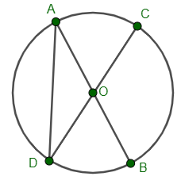

# Subiectul I

## 1. 5p

Rezultatul calculului $25 - 25 : 25$ este egal cu:

a. $0$
b. $24$
c. $25$
d. $6$

## 2. 5p

Valoarea numărului $x$ din proporția $\frac{x}{6} = \frac{3}{18}$ este:

a. $6$
b. $0$
c. $1$
d. $18$

## 3. 5p

În tabelul de mai jos sunt prezentate temperaturile înregistrate la ora 9, la o stație meteo, în fiecare zi a unei săptămâni din luna ianuarie.

$\begin{array}{|c|c|c|c|c|c|c|c|}
\hline
\text{Ziua} & \text{Luni} & \text{Marți} & \text{Miercuri} & \text{Joi} & \text{Vineri} & \text{Sâmbătă} & \text{Duminică} \\
\hline
\text{Temperatură (} ^\circ C\text{)} & -7 & -8 & 3 & 5 & 0 & -1 & 4 \\
\hline
\end{array}$

Conform tabelului, media aritmetică a temperaturilor pozitive înregistrate este egală cu:

a. $4^\circ C$
b. $-11^\circ C$
c. $-\frac{4}{7}^\circ C$
d. $0^\circ C$

## 4. 5p

Suma elementelor mulțimii $M = \{ x \in \mathbb{Z} \ | \ |3x + 2| \leq 11 \}$ este egală cu:

a. $4$
b. $-4$
c. $0$
d. $11$

## 5. 5p

Maria, Cătălin, Cristina și Dan au calculat media geometrică a numerelor $a = 3 + \sqrt{2}$ și $b = 3 - \sqrt{2}$. Rezultatele obținute de ei sunt trecute în tabelul următor:

$\begin{array}{|c|c|c|c|}
\hline
\text{Maria} & \text{Cătălin} & \text{Cristina} & \text{Dan} \\
\hline
6 & -\sqrt{7} & \sqrt{7} & 3 \\
\hline
\end{array}$

Dintre cei patru elevi, cel care a răspuns corect este:

a. Cătălin
b. Maria
c. Dan
d. Cristina

## 6. 5p

Alina afirmă că “15% din 2600 este 390”. Afirmația Alinei este:

a. adevărată
b. falsă

# Subiectul al II-lea

## 1. 5p

În figura următoare sunt reprezentate punctele coliniare $A, B$ și $C$ în această ordine, astfel încât $AC=18$ cm și $BC=8$ cm. Punctul $E$ este mijlocul segmentului $BC$. Lungimea segmentului $AE$ este egală cu:

a. $10$ cm
b. $14$ cm
c. $5$ cm
d. $13$ cm

## 2. 5p

Valoarea lui $x$ din figura alăturată, astfel încât dreptele $a$ și $b$ să fie paralele, este de:

a. $75^\circ$
b. $45^\circ$
c. $30^\circ$
d. $15^\circ$

## 3. 5p

Pe terenul de sport al școlii au fost instalate pentru proba de atletism patru obstacole reprezentate în figura de mai jos prin punctele $A, B, C$ și $M$, astfel încât triunghiul $ABC$ este dreptunghic în $A$ cu $\angle ABC=60^\circ$ și punctul $M$ este situat la mijlocul distanței dintre $B$ și $C$. Știind că distanța dintre obstacolele $A$ și $M$ este de 10 m, atunci distanța dintre $A$ și $C$ este egală cu:

a. $10$ m
b. $10\sqrt{2}$ m
c. $10\sqrt{3}$ m
d. $20$ m

## 4. 5p

În figura de mai jos este reprezentat dreptunghiul $ABCD$. Bisectoarea unghiului $\angle BCD$ intersectează latura $AB$ în punctul $M$ situat la mijlocul distanței dintre $A$ și $B$. Știind că $MB=5$ cm, aria dreptunghiului $ABCD$ este egală cu:

a. $30$ cm$^2$
b. $40$ cm$^2$
c. $50$ cm$^2$
d. $25$ cm$^2$

## 5. 5p

În cercul de centru $O$, $AB$ și $CD$ sunt diametre iar măsura unghiului $\angle DOB$ este de $60^\circ$. Măsura unghiului $\angle CDA$ este de:

a. $30^\circ$
b. $60^\circ$
c. $90^\circ$
d. $120^\circ$

## 6. 5p

Figura de mai jos reprezintă un acvariu în formă de prismă triunghiulară regulată dreaptă $ABCA'B'C'$. Știind că perimetrul bazei $ABC$ a acvariului este egal cu $60$ cm și înălțimea acestuia este de $40$ cm, suma lungimilor tuturor muchiilor acvariului este egală cu:

a. $400$ cm
b. $120$ cm
c. $200$ cm
d. $240$ cm

# Subiectul al III-lea

## 1. 5p

Mai multe persoane doresc să cumpere un obiect. Dacă fiecare persoană dă câte 32 de lei, nu ajung 24 de lei, iar dacă fiecare dă câte 40 de lei, sunt în plus 16 lei.

### a. 2p

Este posibil ca prețul obiectului să fie 190 de lei?

### b. 3p

Aflați prețul obiectului.

## 2. 5p

Se consideră expresia: $E(x) = x^3 + (x + 3)^2 + (x - 2)^2 + (x + 1)(x - 1) - 12$, unde $x \in \mathbb{R}$.

### a. 3p

Demonstrează că $E(x) = x(x + 1)(x + 2)$, pentru orice număr real $x$.

### b. 2p

Demonstrează că $E(n) \Div 6$, pentru orice număr natural $n$.

## 3. 5p

Fie numerele reale $a = 3\sqrt{108} + 2\sqrt{192} - 4\sqrt{12} - 2\sqrt{75}$ și $b = 5\sqrt{48} + 2\sqrt{27} - 2\sqrt{432}$.

### a. 2p

Calculați numărul real $a$;

### b. 3p

Verificați dacă media geometrică a numerelor $a$ și $b$ aparține intervalului $(9; 10)$.

## 4. 5p

Se dă cercul $\mathscr{C}(O, r)$ și punctul $C \in \mathscr{C}(O, r)$, $AB$ diametru cu $AC = OA = 6$ cm. Aflați:

### a. 2p

Măsurile unghiurilor $\triangle ABC$;

### b. 3p

Aflați aria porțiunii hașurate.

## 5. 5p

În figura alăturată este reprezentată o grădină $ABECD$, unde $ABCD$ este dreptunghi, iar $BCE$ este un triunghi echilateral. Segmentele $AE, AC$ și $BC$ reprezintă niște alei, iar $\{P\}=AE \cap BC$. Se știe că $AB = 16$ m, iar aleile $AC$ și $EC$ sunt perpendiculare.

### a. 2p

Calculează aria grădinii

### b. 3p

Arată că lungimea segmentului $BP$ este mai mică decât $6$ m.

## 6. 5p

Fie $VABC$ o piramidă triunghiulară regulată cu muchia laterală $VA=15$ cm și muchia bazei $AB = 18$ cm. Pe muchia $VC$ se consideră punctul $P$ astfel încât $VP = 5$ cm.

### a. 2p

Aratați că $PO\parallel(VAB)$, unde $O$ este centrul de greutate al triunghiului $ABC$.

### b. 3p

Aflați sinusul unghiului format de $PO$ și $VB$.
