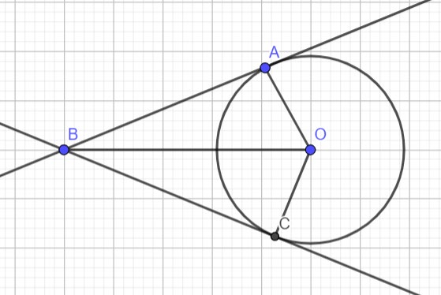
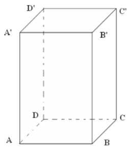

# Subiectul I

## 1. 5p

Rezultatul calculului $10 - 10 : (-2)$ este egal cu:

a. $0$
b. ${-10}$
c. $5$
d. $15$

## 2. 5p

Scrierea fracției zecimale $1,(3)$ sub formă de fracție ordinară ireductibilă este:

a. $\frac{13}{10}$
b. $\frac{13}{9}$
c. $\frac{4}{3}$
d. $\frac{13}{90}$

## 3. 5p

Suma cifrelor prime este:

a. $18$
b. $27$
c. $17$
d. $10$

## 4. 5p

Patru elevi Dan, Ana, Ion, Lara au calculat suma numerelor $a$ și $b$, știind că $a-b=4$ și $a^2-b^2=36$. Rezultatele obținute sunt prezentate în tabelul de mai jos.

$\begin{array}{|c|c|c|c|}
\hline
\text{Dan} & \text{Ana} & \text{Ion} & \text{Lara} \\
\hline
9 & 144 & 40 & 32 \\
\hline
\end{array}$

Dintre cei patru elevi, elevul care a răspuns corect este:

a. Dan
b. Ana
c. Ion
d. Lara

## 5. 5p

Rezultatul calculului $(\sin 45^\circ + \cos 45^\circ)^2$ este:

a. $\frac{\sqrt{2}}{2}$
b. $1$
c. $2$
d. $\sqrt{2}$

## 6. 5p

O serbare a început la ora 12:20 și s-a finalizat la ora 13:50, în aceeași zi. Un elev afirmă că: „Serbarea a avut o durată de o oră și jumătate”. Știind că serbarea nu a avut pauză, afirmația elevului este:

a. adevărată
b. falsă

# Subiectul al II-lea

## 1. 5p

În figura următoare punctele $A, B, C, D$ sunt coliniare, în această ordine, astfel încât $B$ este mijlocul lui $AC$ iar punctul $D$ este simetricul punctului $B$ față de punctul $C$. Dacă $AC=8$ cm, atunci lungimea segmentului BD este egală cu:

a. $8$ cm
b. $4$ cm
c. $12$ cm
d. $16$ cm

## 2. 5p

În figura următoare unghiurile $AOB$ și $BOC$ sunt adiacente complementare iar semidreapta $OD$ este bisectoarea unghiului $AOB$. Dacă măsura unghiului $BOC$ este egală cu $22^\circ$, atunci măsura unghiului $AOD$ este egală cu:

a. $22^\circ$
b. $90^\circ$
c. $68^\circ$
d. $34^\circ$

## 3. 5p

În figura alăturată este reprezentat triunghiul isoscel $ABC$ de bază $BC$. Dacă $CB = 8$ cm, $\angle B=30^\circ$, $D$ mijlocul laturii $BC$, atunci distanța de la punctul D la dreapta AB are lungimea de:

a. $4\sqrt{3}$ cm
b. $4$ cm
c. $2\sqrt{3}$ cm
d. $2$ cm

## 4. 5p

În figura alăturată, $OA$ și $OC$ sunt raze, punctul B $\not \in \mathcal{C} (O, 3 \text{cm})$ , $AB$ și $BC$ sunt tangente cercului $\mathcal{C} (O, 3 \text{cm})$. Dacă $OB=6$ cm, atunci suma lungimilor tangentelor AB și BC este egală cu:

a. $12$ cm
b. $6\sqrt{5}$ cm
c. $10$ cm
d. $6\sqrt{3}$ cm

## 5. 5p

În figura alăturată este reprezentat un dreptunghi $ABCD$ cu $AB=12$ cm, $BC=8$ cm și punctele $M$ și $P$ mijloacele laturilor $AB$, respectiv $BC$. Aria triunghiului $PDM$ este egală cu:

a. $96$ cm$^2$
b. $36$ cm$^2$
c. $60$ cm$^2$
d. $24$ cm$^2$

## 6. 5p

Se dă o prismă patrulateră regulată cu suma lungimilor tuturor muchiilor egală cu $64$ cm și aria bazei egală cu $25$ cm$^2$. Aria unei fețe laterale este egală cu:

a. $22$ cm$^2$
b. $36$ cm$^2$
c. $30$ cm$^2$
d. $120$ cm$^2$

# Subiectul al III-lea

## 1. 5p

Trei frați Ana, Lia, Bogdan au împreună $1360$ de lei. Ana are cu $170$ de lei mai mult decât Bogdan iar Lia are cu $120$ de lei mai puțin decât Ana.

### a. 2p

Poate avea Bogdan $390$ de lei? Justifică răspunsul dat.

### b. 3p

Să se determine suma de bani pe care o are Lia.

## 2. 5p

Se dau numerele $a = \left( 2 \frac{1}{3} + \frac{4}{5} : \frac{8}{15} \right) \cdot \left( \frac{-12}{23} \right)$ și $b = \frac{-2}{2-\sqrt{2}} + 6\sqrt{6} : \left( -2\sqrt{3} \right) + \frac{4}{\sqrt{2}}$

### a. 2p

Să se arate că $a = -2$

### b. 3p

Calculează $(a+b-1)^{2023}$

## 3. 5p

Se consideră expresia $E(x) = (2x-1)^2 - (x\sqrt{3} + 2)(x\sqrt{3} - 2) - 10$

### a. 2p

Arată că $E(-2) = 7$.

### b. 3p

Să se determine suma numerelor reale $a$ și $b$ pentru care $E(x) = (x+a)(x+b)$

## 4. 5p

În figura alăturată este reprezentat trapezul ABCD cu $AB \parallel CD$, $AB > CD$, $\angle BCD = 120^\circ$, $CD = CB = 12$ cm. Fie $F \in AB$ astfel încât $CF \perp AB$.

### a. 2p

Calculează $CF$

### b. 3p

Să se calculeze distanța de la punctul C la diagonala $DB$.

## 5. 5p

În figura alăturată este reprezentat un dreptunghi $ABCD$ cu $AD = 6$ cm, $DB = 12$ cm iar $OP$ este mediatoarea diagonalei $DB$, $P \in AB$.

### a. 2p

Să se calculeze aria dreptunghiului $ABCD$.

### b. 3p

Să se calculeze lungimea segmentului $OP$.

## 6. 5p

În figura alăturată se dă paralelipipedul dreptunghic $ABCDA'B'C'D'$ cu $AB = 6$ cm, $BC = 6\sqrt{3}$ cm și $CC' = 12$ cm.

### a. 2p

Să se calculeze măsura unghiului dintre diagonala $A'C$ a paralelipipedului dreptunghic și planul bazei $ABCD$.

### b. 3p

Să se calculeze distanța de la punctul $A'$ la planul $DBB'$.
