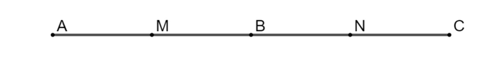
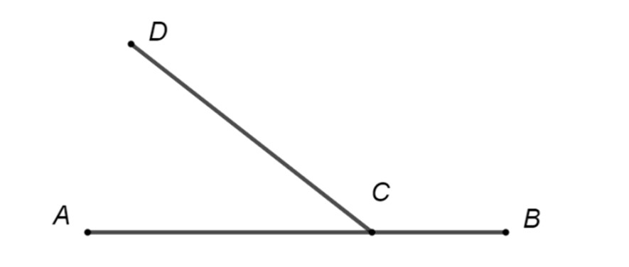
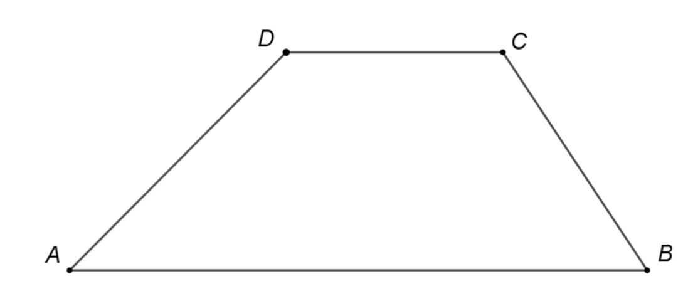
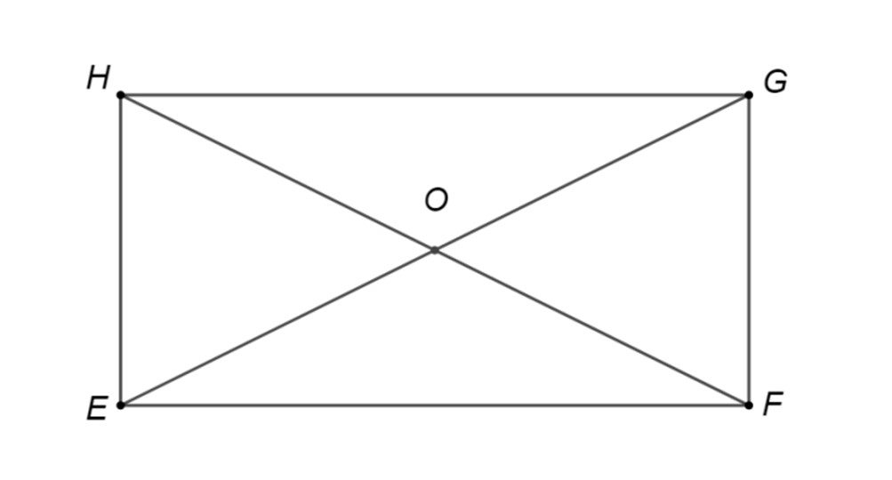
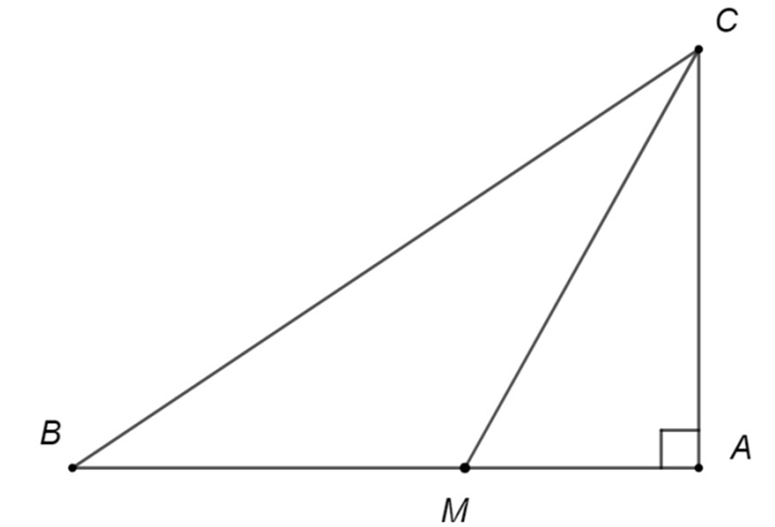
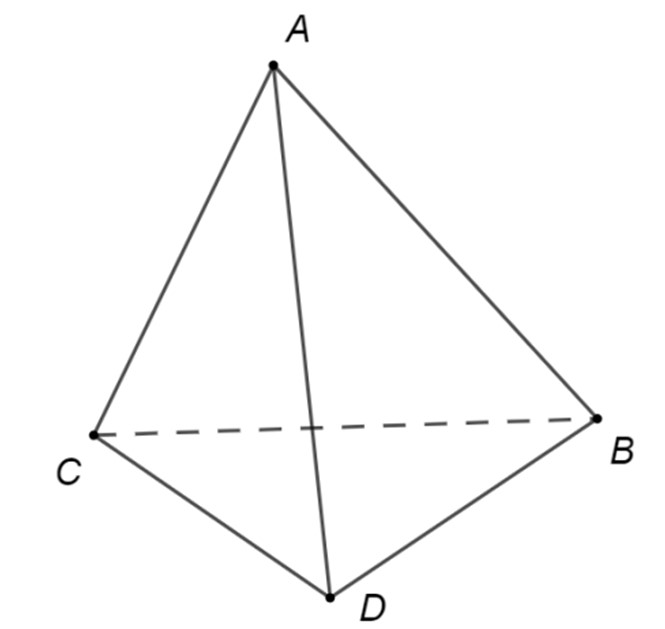
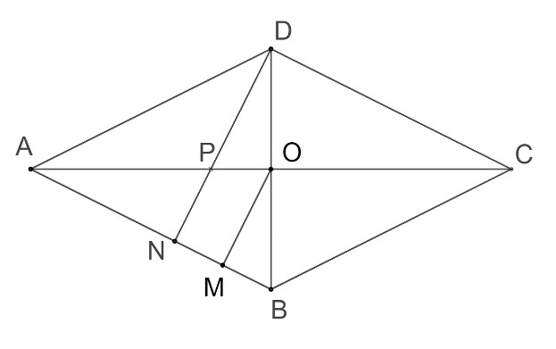
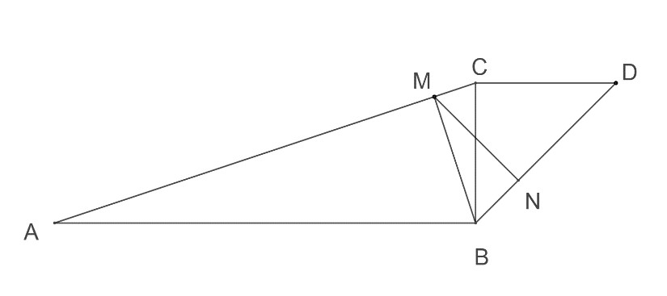
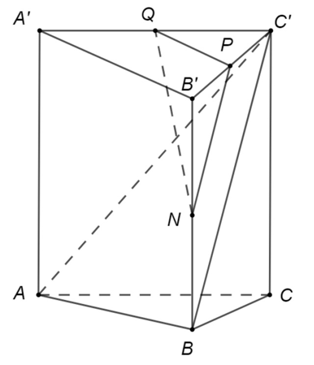

# Subiectul I

## 1. 5p

Numărul 242 este multiplu al numărului:

a. $7$
b. $11$
c. $12$
d. $17$

## 2. 5p

Valoarea lui $x$ care verifică egalitatea $\frac{x}{30} = \frac{7}{15}$ este egală cu:

a. $\frac{7}{3}$
b. $8$
c. $14$
d. $16$

## 3. 5p

Opusul numărului $a = \left( \frac{1}{2} - \frac{1}{3} \right) : \frac{1}{36}$ este:

a. $-6$
b. $-3$
c. $3$
d. $6$

## 4. 5p

Cel mai mare dintre numerele raționale $2,(4)$; $2,4(2)$; $2,22$; $2,(42)$ este:

a. $2,4(2)$
b. $2,(4)$
c. $2,(42)$
d. $2,22$

## 5. 5p

Dacă $a = \sqrt{5} + \sqrt{3}$ și $b = \sqrt{15}$, atunci $a^2 - 2b + 1$ este egal cu:

a. $\sqrt{15}$
b. $9 - 2\sqrt{15}$
c. $8$
d. $9$

## 6. 5p

În tabelul următor sunt înregistrate temperaturile medii zilnice dintr-o săptămână.

$\begin{array}{|c|c|c|c|c|c|c|c|}
\hline
\bold{Ziua} & \text{L} & \text{M} & \text{M} & \text{J} & \text{V} & \text{S} & \text{D} \\
\hline
\bold{Temperatura} & -4^\circ\text{C} & -3^\circ\text{C} & -2^\circ\text{C} & 1^\circ\text{C} & x^\circ\text{C} & 1^\circ\text{C} & 2^\circ\text{C} \\
\hline
\end{array}$

Dacă temperatura medie din aceea săptămână a fost $-1^\circ\text{C}$, atunci $x$ este egal cu:

a. $-2$
b. $0$
c. $1$
d. $3$

# Subiectul al II-lea

## 1. 5p

În figura alăturată, punctul $M$ este mijlocul segmentului $AB$, $N$ este mijlocul segmentului $BC$, iar $C$ este simetricul punctului $A$ față de punctul B. Valoarea raportului $\frac{AN}{MN}$ este:

 size=40

a. $\frac{2}{3}$
b. $1$
c. $\frac{4}{3}$
d. $\frac{3}{2}$

## 2. 5p

În figura alăturată, unghiurile $ACD$ și $DCB$ sunt adiacente suplementare. Măsura unghiului format de bisectoarele unghiurilor $ACD$ și $DCB$ este:

a. $90^\circ$
b. $100^\circ$
c. $120^\circ$
d. $150^\circ$

## 3. 5p

Figura alăturată reprezintă schița unui teren în formă de trapez $ABCD$ cu aria de $144$ m$^2$ și lungimea liniei mijlocii de $36$ m. Distanța dintre laturile $AB$ și $DC$ este egală cu:

a. $2$ m
b. $4$ m
c. $8$ m
d. $12$ m

## 4. 5p

Dreptunghiul $EFGH$ din figura alăturată are lungimea $EF = 15$ cm și lățimea $FG = 5\sqrt{3}$ cm. Dacă $HF \cap EG = \{O\}$, măsura unghiului $GOF$ este:

a. $60^\circ$
b. $90^\circ$
c. $120^\circ$
d. $150^\circ$

## 5. 5p

În figura alăturată $ABC$ este un triunghi dreptunghic în $A$ cu măsura unghiului $B$ de $30^\circ$. Dacă lungimea bisectoarei $CM$ este egală cu $10$ cm, atunci lungimea catetei $AB$ este egală cu:

a. $8$ cm
b. $10$ cm
c. $15$ cm
d. $16$ cm

## 6. 5p

În figura alăturată $ABCD$ este un tetraedru regulat cu aria feței $ABC$ egală cu $9\sqrt{3}$ dm$^2$. Suma lungimilor tuturor muchiilor tetraedrului este egală cu:

a. $18$ dm
b. $36$ dm
c. $72$ dm
d. $81$ dm

# Subiectul al III-lea

## 1. 5p

Radu și Tudor au împreună 800 de lei. Dacă Radu i-ar da lui Tudor o cincime din suma pe care o are, atunci cei doi copii ar avea sume egale.

### a. 2p

Este posibil ca Radu să aibă 600 de lei? Justifică răspunsul dat.

### b. 3p

Află ce sumă are Tudor.

## 2. 5p

Se consideră numerele $a = \left( \frac{18}{\sqrt{20}} - \frac{6}{\sqrt{45}} + \frac{32}{\sqrt{80}} \right) \cdot \left( \frac{3}{\sqrt{5}} \right)^{-1}$ și $b = 5^{3} \cdot 25^{3} : 125^{2}$.

### a. 2p

Arată că numărul $a = 5$.

### b. 3p

Demonstrează că media geometrică a numerelor $a$ și $b$ este pătrat perfect.

## 3. 5p

Se consideră expresia $E(x) = (3x - 2)^2 + (1 - x\sqrt{5})(x\sqrt{5} + 1) + 4$, unde $x \in \mathbb{R}$.

### a. 2p

Arată că $E(x) = 4x^2 - 12x + 9$, pentru orice număr real $x$.

### b. 3p

Determină valorile întregi ale lui $n$ pentru care $E(n) < 36$.

## 4. 5p

Rombul $ABCD$ din figura alăturată are înălțimea $DN = 8$ cm. Se știe că $AC \cap BD = \{O\}$ și proiecția $AM$ a segmentului $OA$ pe dreapta $AB$ are lungimea de $8$ cm.

### a. 2p

Arată că $OM = 4$ cm.

### b. 3p

Dacă $AC \cap DN = \{P\}$, calculează aria patrulaterului $PNMO$.

## 5. 5p

În figura alăturată sunt reprezentate triunghiurile $ABC$ și $BCD$ dreptunghice în $B$, respectiv în $C$. Se știe că $\angle BAC = 15^\circ$, $BC = CD$, $BM \perp AC$ și $MN \perp BD$.

 size=30

### a. 2p

Arată că măsura unghiului $BMN$ este de $30^\circ$.

### b. 3p

Dacă $BN = 2$ cm, află distanța de la $M$ la dreapta $BC$.

## 6. 5p

În figura alăturată este desenată o prismă triunghiulară regulată $ABC A'B'C'$ cu $AB = 8$ m și $AA' = 6$ m. Punctele $N$, $P$ și $Q$ sunt mijloacele segmentelor $BB'$, $B'C'$, respectiv $A'C'$.

### a. 2p

Arată că planele $(QPN)$ și $(C'AB)$ sunt paralele.

### b. 3p

Calculează cosinusul unghiului determinat de dreptele $QP$ și $C'B$.
