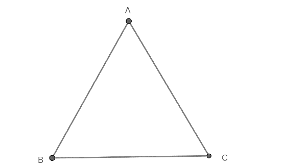

# Subiectul I

## 1. 5p

Rezultatul calculului $\frac{1}{2} + \frac{1}{3} + \frac{1}{6}$ este:

a. $\frac{3}{11}$
b. $1$
c. $\frac{5}{6}$
d. $\frac{7}{6}$

## 2. 5p

Cel mai mare număr întreg din intervalul $[-3, 4 )$ este:

a. $4$
b. $-3$
c. $5$
d. $3$

## 3. 5p

Numărul numerelor divizibile cu $3$ din mulțimea $A = \{1,2,3,4,5,6,7,8,9,10,11,12\}$ este:

a. $1$
b. $3$
c. $5$
d. $4$

## 4. 5p

Media aritmetică a numerelor $4 + 2\sqrt{2}$ și $2(1 - \sqrt{2})$ este:

a. $2$
b. $3 + 2\sqrt{2}$
c. $2 - \sqrt{2}$
d. $3$

## 5. 5p

Temperatura maximă măsurată este prezentată în tabelul următor:

$\begin{array}{|c|c|c|c|c|c|}
\hline
\text{Ziua} & \text{Luni} & \text{Marți} & \text{Miercuri} & \text{Joi} & \text{Vineri} \\
\hline
\text{Temperatura} & 5^\circ & -2^\circ & 4^\circ & -3^\circ & 2^\circ \\
\hline
\end{array}$

Cea mai mare diferență de temperatură este între zilele:

a. Luni și Marți
b. Miercuri și Joi
c. Luni și Joi
d. Marți și Joi

## 6. 5p

Dacă numerele reale $a$ și $b$ sunt direct proporționale cu $2$ și $3$, iar $a + b = 20$, atunci egalitatea $a + 2b = 30$ este:

a. Adevărată
b. Falsă

# Subiectul al II-lea

## 1. 5p

În figura alăturată punctele $A$, $B$ și $C$ sunt coliniare, iar $M$ și $N$ sunt mijloacele segmentelor $AB$ și $AC$. Dacă $AB = 4cm$ și $BC = 2cm$, atunci lungimea segmentului $MN$ este:

a. $1$ cm
b. $2$ cm
c. $3$ cm
d. $1,5$ cm

## 2. 5p

Unghiurile $\angle AOB$ și $\angle COD$ din figura alăturată sunt opuse la vârf. Semidreapta $OE$ este bisectoarea unghiului $\angle AOC$, iar semidreapta $OF$ este semidreapta opusă semidreptei $OE$. Dacă $\angle COD = 40^\circ$, atunci măsura unghiului $\angle AOF$ este egală cu:

a. $80^\circ$
b. $70^\circ$
c. $250^\circ$
d. $110^\circ$

## 3. 5p

Fie $\triangle ABC$ în care $\angle A = 60^\circ$ și $\angle B =  \frac{\angle B + \angle C}{2}$. Dacă $BC = 2cm$, atunci perimetrul $\triangle ABC$ este:

a. $7$ cm
b. $5$ cm
c. $6 + 2\sqrt{3}$ cm
d. $6$ cm

## 4. 5p

Se consideră $\triangle ABC$ ($\angle A = 90^\circ$) și $BC = 6cm$. Dacă $G$ este centrul de greutate al $\triangle ABC$, atunci lungimea segmentului $AG$ este:

a. $2$ cm
b. $4$ cm
c. $3$ cm
d. $6$ cm

## 5. 5p

Fie $AB$ diametrul în cercul de centru $O$ și rază $10$ cm și $CD \perp AB$. Dacă $AC = 10\sqrt{3}$ cm, atunci aria triunghiului $\ ADC$ este:

a. $24$ cm²
b. $75$ cm²
c. $75\sqrt{3}$ cm²
d. $50\sqrt{3}$ cm²

## 6. 5p

Suma muchiilor unui tetraedru regulat este $36cm$. Suma ariilor tuturor fețelor tetraedrului este:

a. $36\sqrt{3}$ cm²
b. $30$ cm²
c. $12\sqrt{2}$ cm²
d. $18$ cm²

# Subiectul al III-lea

## 1. 5p

Un excursionist parcurge un traseu în trei zile. În prima zi parcurge $\frac{1}{4}$ din lungimea traseului, în a doua zi $\frac{2}{3}$ din rest, iar în a treia zi, ultimii $24$ km.

### a. 2p

Este posibil ca lungimea traseului să fie de $100km$? Justificați răspunsul.

### b. 3p

Câți kilometri a parcurs excursionistul în a doua zi?

## 2. 5p

Se consideră numerele $a = \frac{9}{\sqrt{3}} - \frac{3}{2} \sqrt{1 + \frac{1}{3}} + \sqrt{\frac{14}{5} \cdot\frac{20} {7}}$ și $b = \sqrt{12} - \sqrt{8}$.

### a. 2p

Să se arate că $a = 2\sqrt{3} + 2\sqrt{2}$.

### b. 3p

Să se arate că media geometrică a numerelor $a$ și $b$ este un număr natural.

## 3. 5p

Se consideră mulțimile $A = \{x \in \mathbb{Z} \mid |2x - 1| \leq 3\}$ și $B = \{x \in \mathbb{R} \mid x^2 = 1\}$.

### a. 3p

Să se determine mulțimea $A$.

### b. 2p

Aflați cardinalul mulțimii $A \cap B$.

## 4. 5p

În exteriorul triunghiului isoscel $\ ABC$ ($AB = AC$) se construiesc triunghiurile echilaterale $\ ABD$ și $\ ACE$. Notăm $BE \cap CD = \{O\}$.

### a. 2p

Să se arate că $BE \equiv CD$.

### b. 3p

Demonstrați că $OA \perp DE$.

## 5. 5p

Se consideră paralelogramul $ABCD$ având aria $32cm^2$. Fie $E$ mijlocul segmentului $AB$ și $F$ $\in$ $CE$ astfel încât $CF = 2FE$.

### a. 2p

Aflați aria triunghiului $CEB$.

### b. 3p

Arătați că punctele $B$, $F$, $D$ sunt coliniare.

## 6. 5p

În piramida patrulateră regulată $VABCD$ avem $VA = 12cm$ și $\angle VAB = 70^\circ$. Pe muchia $VB$ se consideră punctul $E$, iar pe muchia $VC$ se consideră punctul $F$.

### a. 2p

Calculați măsura unghiului $\angle AVB$.

### b. 3p

Să se determine cea mai mică valoare a sumei $AE + EF + FD$.
