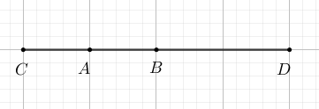
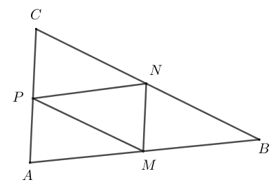
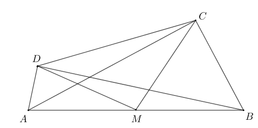
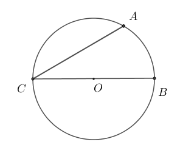
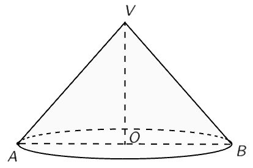
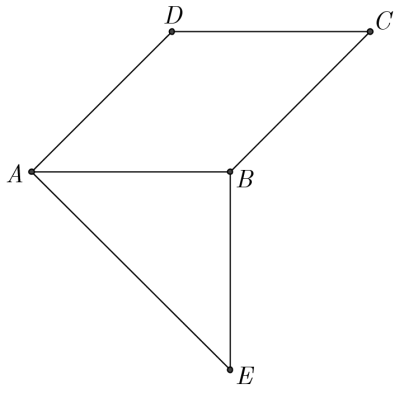
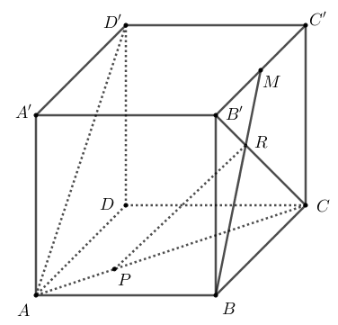

# Subiectul I

## 1. 5p

Numărul natural scris în baza zece, de forma $\overline{17x}$, divizibil cu 10, este egal cu:

a. $17$
b. $70$
c. $100$
d. $170$

## 2. 5p

Numărul care reprezintă $20\%$ din $50$ este egal cu:

a. $10$
b. $20$
c. $25$
d. $100$

## 3. 5p

Suma numerelor întregi din intervalul $[-2, 3]$ este egală cu:

a. $-9$
b. $-3$
c. $3$
d. $6$

## 4. 5p

Inversul numărului $\frac{2}{3}$ este numărul:

a. $-\frac{3}{2}$
b. $-\frac{2}{3}$
c. $\frac{2}{3}$
d. $\frac{3}{2}$

## 5. 5p

Patru elevi, Elena, Maria, George și Mihai, au calculat media geometrică a numerelor $x = 3 - 2\sqrt{2}$ și $y = 3 + 2\sqrt{2}$ și au obținut următoarele rezultate:

$\begin{array}{|c|c|c|c|}
\hline
\text{Elena} & \text{Maria} & \text{George} & \text{Mihai} \\
\hline
\sqrt{17} & \sqrt{2} & 1 & 3 \\
\hline
\end{array}$

Dintre cei patru elevi, cel care a calculat corect media geometrică este:

a. Elena
b. Maria
c. George
d. Mihai

## 6. 5p

Afirmația „Numărul $4$ este mai mare decât numărul $2\sqrt{5}$.” este:

a. adevărată
b. falsă

# Subiectul al II-lea

## 1. 5p

În figura alăturată este reprezentat segmentul $AB$ cu lungimea de $5$ cm. Punctul $C$ este simetricul punctului $B$ față de punctul $A$, iar punctul $D$ este simetricul punctului $C$ față de punctul $B$. Lungimea segmentului $CD$ este egală cu:

a. $5$ cm
b. $10$ cm
c. $15$ cm
d. $20$ cm

## 2. 5p

În figura alăturată, unghiurile $AOC$ și $BOD$ sunt opuse la vârf. Măsura unghiului $AOC$ este egală cu $30^\circ$, iar semidreapta $OE$ este bisectoarea unghiului $BOC$. Măsura unghiului $DOE$ este egală cu:

a. $75^\circ$
b. $90^\circ$
c. $105^\circ$
d. $150^\circ$

## 3. 5p

În figura alăturată este reprezentat triunghiul $ABC$ cu $AB=12$ cm, $BC=13$ cm și $AC=7$ cm. Punctele $M, N$ și $P$ sunt mijloacele segmentelor $AB$, $BC$, respectiv $AC$. Perimetrul triunghiului $MNP$ este egal cu:

a. $8$ cm
b. $16$ cm
c. $18$ cm
d. $32$ cm

## 4. 5p

În figura alăturată este reprezentat paralelogramul $ABCD$. Dreapta $AC$ este perpendiculară pe dreapta $BC$ și dreapta $AD$ este perpendiculară pe dreapta $BD$. Punctul $M$ este mijlocul segmentului $AB$ și măsura unghiului $DCM$ este egală cu $40^\circ$. Măsura unghiului $CMD$ este egală cu:

a. $80^\circ$
b. $90^\circ$
c. $100^\circ$
d. $120^\circ$

## 5. 5p

În figura alăturată este reprezentat cercul de centru $O$ și diametru $BC$. Punctul $A$ aparține cercului, astfel încât măsura arcului mic $AC$ este egală cu $120^\circ$. Măsura unghiului $ACB$ este egală cu:

a. $30^\circ$
b. $60^\circ$
c. $90^\circ$
d. $120^\circ$

## 6. 5p

În figura alăturată este reprezentat un con circular drept cu secțiunea axială triunghiul dreptunghic $VAB$ și raza bazei conului $AO=4$ cm. Generatoarea acestui con are lungimea egală cu:

a. $4$ cm
b. $4\sqrt{2}$ cm
c. $8$ cm
d. $8\sqrt{2}$ cm

# Subiectul al III-lea

## 1. 5p

Într-un bloc de locuințe sunt 22 de apartamente cu două, respectiv cu patru camere, în total fiind $60$ de camere.

### a. 2p

Este posibil ca în acest bloc să fie $16$ apartamente cu patru camere? Justifică răspunsul dat.

### b. 3p

Determină numărul de apartamente cu două camere din acest bloc.

## 2. 5p

Se consideră expresia $E(x) = \left(\frac{ x^2 - 9 }{ x^2 - 16 } - 1 \right) : \left( \frac{1}{ x + 4 } + \frac{1}{ x - 4 } - \frac{3}{ x^2 - 16 } \right)$, unde $x$ este număr real, $x \neq -4$, $x \neq 4$ și $x \neq \frac{3}{2}$.

### a. 2p

Arată că $E(x) = \frac{7}{2x - 3}$, unde $x$ este număr real, $x \neq -4$, $x \neq 4$ și $x \neq  \frac{3}{2}$.

### b. 3p

Determină numerele naturale $n$ pentru care $E(n)$ este număr natural.

## 3. 5p

Se consideră numerele $a = \left(-\frac{1}{3}\right)^{32} : \left(-\frac{1}{3}\right)^{30} \cdot (-6)^2$ și $b = \left(\frac{1}{1+2} + \frac{1}{1+2+3}\right) \cdot (0,5)^{-2}$.

### a. 2p

Arată că $a = 4$.

### b. 3p

Calculează media aritmetică a numerelor $a$ și $b$.

## 4. 5p

În figura alăturată este reprezentat triunghiul $ABC$ cu $BC=10$cm, $AC=20$cm și măsura unghiului $ACB$ este egală cu $30^\circ$. Punctul $D$ aparține segmentului $AC$, astfel încât unghiul $DBC$ este congruent cu $BAC$.

### a. 2p

Arată că aria triunghiului $ABC$ este egală cu $50$ cm$^2$.

### b. 3p

Calculează lungimea segmentului $CD$.

## 5. 5p

În figura alăturată sunt reprezentate rombul $ABCD$ cu măsura unghiului $BAD$ egală cu $45^\circ$ și triunghiul dreptunghic isoscel $ABE$ cu $AB = BE = 10$cm. Punctele $C$ și $E$ sunt de o parte și de alta a dreptei $AB$.

### a. 2p

Arată că dreapta $DA$ este perpendiculară pe dreapta $AE$.

### b. 3p

Arată că tangenta unghiului $CAE$ este egală cu $\sqrt{2} + 1$.

## 6. 5p

În figura alăturată este reprezentat cubul $ABCD A'B'C'D'$ cu $AB = 6$cm. Punctul $M$ este mijlocul segmentului $B'C'$ și dreptele $BM$ și $B'C$ se intersectează în punctul $R$. Punctul $P$ aparține segmentului $AC$, astfel încât $AP = 2\sqrt{2}$cm.

### a. 2p

Arată că $CP = 2 \cdot AP$.

### b. 3p

Determină măsura unghiului dreptelor $PR$ și $AD'$.
