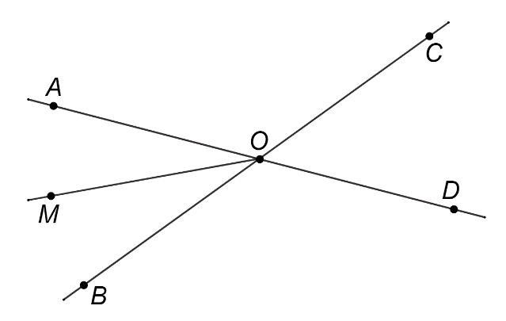
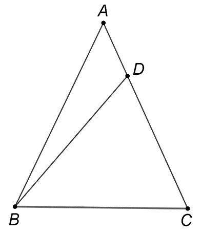
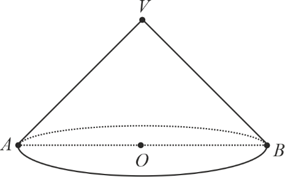
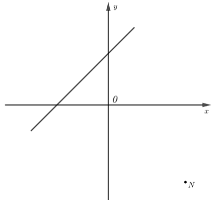
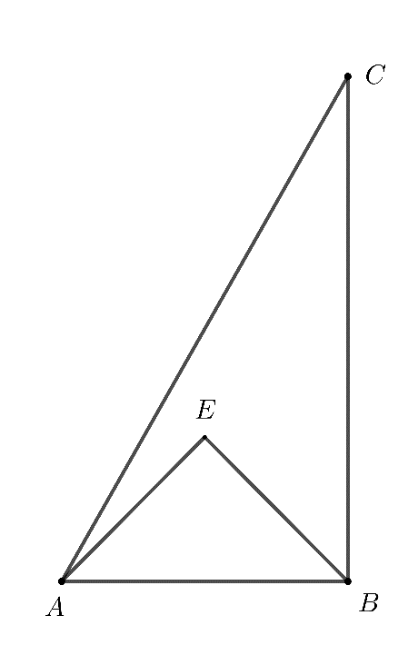
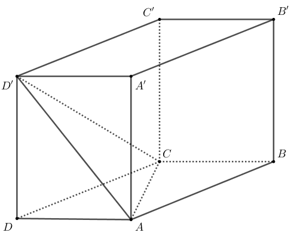

# Subiectul I

## 1. 5p

Rezultatul calculului $3 + 2 \cdot 5$ este egal cu:

a. $25$
b. $13$
c. $10$
d. $1$

## 2. 5p

Dacă $\frac{x}{2} = \frac{3}{4}$, atunci $4 \cdot x$ este egal cu:

a. $\frac{3}{2}$
b. $\frac{8}{3}$
c. $6$
d. $12$

## 3. 5p

Soluția ecuației $2 - x = 2$ este numărul:

a. $-4$
b. $0$
c. $2$
d. $4$

## 4. 5p

Cel mai mic element al mulțimii $A = \left\{ \frac{1}{9}, \frac{1}{99}, \frac{1}{999}, \frac{1}{9999} \right\}$ este:

a. $\frac{1}{9}$
b. $\frac{1}{99}$
c. $\frac{1}{999}$
d. $\frac{1}{9999}$

## 5. 5p

Patru elevi, Andra, Marius, Ioana și David, au calculat produsul numerelor $a = \sqrt{5}$ și $b = \sqrt{20}$. Rezultatele obținute sunt prezentate în tabelul de mai jos:

$\begin{array}{|c|c|c|c|}
\hline
\text{Andra} & \text{Marius} & \text{Ioana} & \text{David} \\
\hline
10 & 5 & 2\sqrt{5} & \sqrt{10} \\
\hline
\end{array}$

Rezultatul corect a fost obținut de către:

a. Andra
b. Marius
c. Ioana
d. David

## 6. 5p

Alina afirmă că: „în intervalul de numere reale $[-3,2]$ sunt 7 numere întregi.” Afirmatia Alinei este:

a. adevărată
b. falsă

# Subiectul al II-lea

## 1. 5p

În figura alăturată sunt reprezentate punctele coliniare $ A, B, C $ și $ D $, în această ordine, astfel încât $ AB = BC = CD $, iar lungimea segmentului $ CD $ este egală cu 10cm. Lungimea segmentului $ AD $ este egală cu:

a. 30cm
b. 20cm
c. 15cm
d. 10cm

## 2. 5p

În figura alăturată sunt reprezentate unghiurile opuse la vârf $ AOB $ și $ COD $, cu punctele $ A, O $ și $ D $ coliniare. Măsura unghiului $ AOB $ este egală cu $ 50^\circ $ și $ OM $ este bisectoarea unghiului $ AOB $. Măsura unghiului $ DOM $ este egală cu:

a. $25^\circ$
b. $50^\circ$
c. $130^\circ$
d. $155^\circ$

## 3. 5p

În figura alăturată este reprezentat triunghiul isoscel $ABC$ cu $AB = AC$ și $\angle BAC = 50^\circ$. Punctul $D$ aparține segmentului $AC$, astfel încât $BD = BC$. Măsura unghiului $BDC$ este egală cu:

a. $50^\circ$
b. $65^\circ$
c. $115^\circ$
d. $130^\circ$

## 4. 5p

În figura alăturată este reprezentat paralelogramul $ABCD$ cu $AB$=10cm și $BC$=6cm. Perimetrul paralelogramului $ABCD$ este egal cu:

a. $16$cm
b. $24$cm
c. $32$cm
d. $40$cm

## 5. 5p

În figura alăturată este reprezentat cercul de centru $O$. Punctele $A$ și $B$ aparțin cercului, astfel încât măsura unghiului $AOB$ este de $60^\circ$ și $AB = 10$cm. Lungimea cercului este egală cu:

a. 10$\pi$ cm
b. 20$\pi$ cm
c. 100$\pi$ cm
d. 200$\pi$ cm

## 6. 5p

În figura alăturată este reprezentat un con circular drept cu secțiunea axială triunghiul dreptunghic $VAB$. Înălțimea conului are lungimea egală cu $2\sqrt{2}$cm. Aria bazei conului este egală cu:

a. 8 cm$^2$
b. 16 cm$^2$
c. 8$\pi$ cm$^2$
d. 16$\pi$ cm$^2$

# Subiectul al III-lea

## 1. 5p

Mihai a cheltuit o sumă de bani în patru zile. În prima zi a cheltuit 20% din întreaga sumă, în a doua zi 30% din suma rămasă, în a treia zi cu 20 de lei mai mult decât a doua zi, iar în a patra zi a cheltuit ultimii 44 de lei.

### a. 2p

Verifică dacă Mihai a cheltuit în a doua zi un sfert din întreaga sumă de bani. Justifică răspunsul dat.

### b. 3p

Determină suma de bani cheltuită de Mihai, în total, în cele patru zile.

## 2. 5p

Se consideră expresia $E(x) = \left( \frac{x}{9+3x} - \frac{2}{x+3} + \frac{3}{x^2+3x} \right) : \left( \frac{x}{3} + \frac{3}{x} - 2 \right)$, unde $x$ este un număr real, $x \neq -3$, $x \neq 0$ și $x \neq 3$.

### a. 2p

Arată că $\frac{x}{9+3x} - \frac{2}{x+3} + \frac{3}{x^2+3x} = \frac{(x-3)^2}{3x(x+3)}$, pentru orice număr real $x$, $x \neq -3$ și $x \neq 0$.

### b. 3p

Determină numărul natural $n$ pentru care $5 \cdot E(n)$ este număr natural.

## 3. 5p

Se consideră funcția $f : \mathbb{R} \rightarrow \mathbb{R}$, $f(x) = x + 2$.

### a. 2p

Arată că $2023 \cdot f(-2) = 0$.

### b. 3p

Punctele $A$ și $B$ sunt punctele de intersecție a reprezentării geometrice a graficului funcției $f$ cu axele $Ox$, respectiv $Oy$, ale sistemului de axe ortogonale $xOy$, iar punctul $M$ este mijlocul segmentului $AB$. Arată că punctele $N$, $O$ și $M$ sunt coliniare, unde $N(3,-3)$.

## 4. 5p

În figura alăturată este reprezentat dreptunghiul $ABCD$ cu $AB=12$ cm și $BC=9$ cm. Punctul $E$ aparține segmentului $AC$, astfel încât $AE=10$ cm. Prin $E$ se duc dreptele $QN$ și $PM$ paralele cu dreptele $AB$, respectiv $BC$. Punctele $M, N, P$ și $Q$ aparțin segmentelor $AB, BC, CD$ și respectiv $AD$.

### a. 2p

Arată că $AC=15$ cm.

### b. 3p

Arată că aria patrulaterului $AMEQ$ este de patru ori mai mare decât aria patrulaterului $CNEP$.

## 5. 5p

În figura alăturată este reprezentat triunghiul $ABC$, dreptunghic în $B$, cu $AB = 2\sqrt{2}$ cm, $BC = 2\sqrt{6}$ cm și triunghiul dreptunghic isoscel $AEB$ cu $AE = EB$. Punctele $E$ și $C$ sunt de aceeași parte a dreptei $AB$.

### a. 2p

Arată că perimetrul triunghiului $ABC$ este egal cu $2\sqrt{2}(3 + \sqrt{3})$ cm .

### b. 3p

Calculează distanța de la punctul $E$ la dreapta $AC$.

## 6. 5p

În figura alăturată este reprezentat paralelipipedul dreptunghic $ABCD A'B'C'D'$ cu $AB = A'A' = 4$ cm și $BC = 2$ cm.

### a. 2p

Arată că aria totală a paralelipipedului dreptunghic $ABCD A'B'C'D'$ este egală cu $64$ cm².

### b. 3p

Arată că dreapta $NP$ este paralelă cu planul $(ACD')$, unde punctul $N$ este proiecția punctului $C'$ pe dreapta $BD'$ și punctul $P$ este proiecția punctului $C'$ pe dreapta $CB'$.
