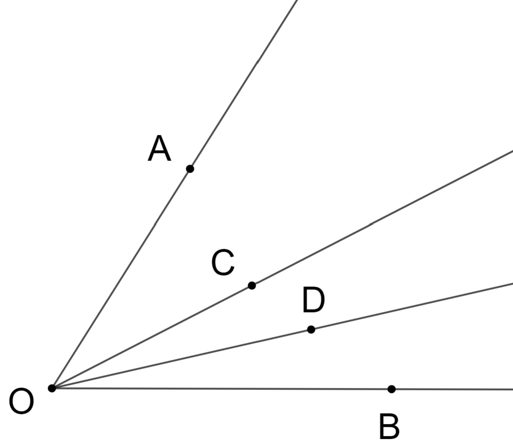
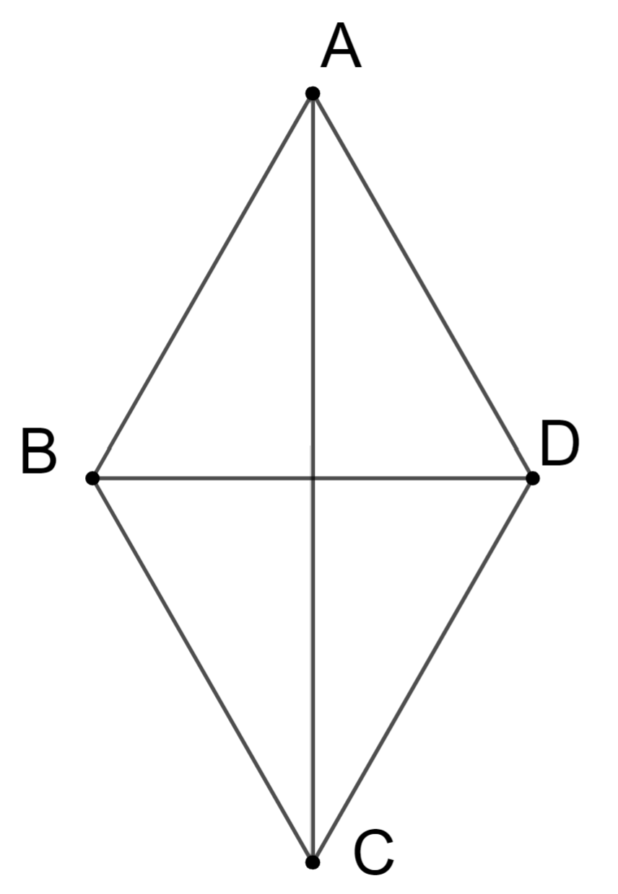
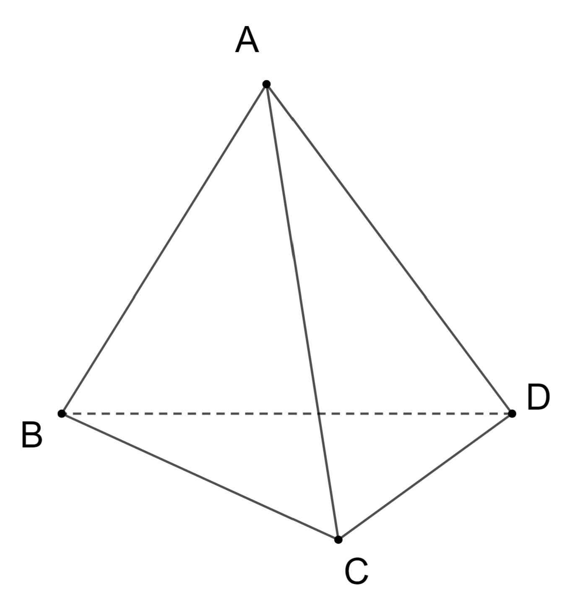
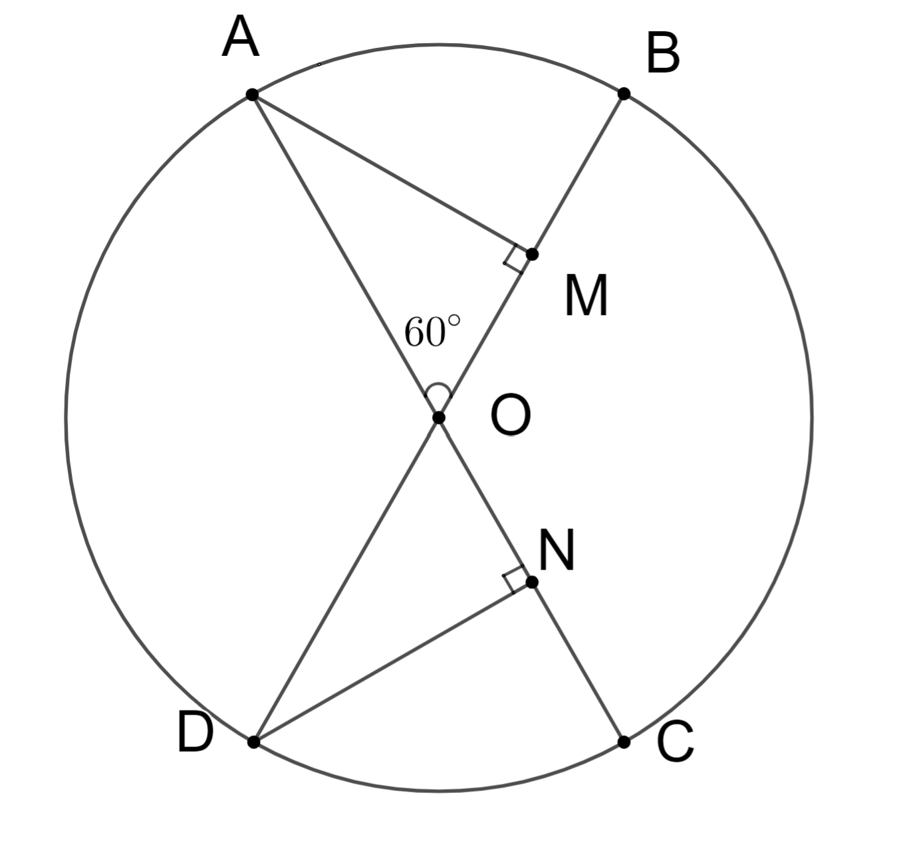

# Subiectul I

## 1. 5p

Mulțimea numerelor reale mai mici decât $-3$ este:

a. $(-3;+\infty)$
b. $(-\infty ; 3)$
c. $(-\infty ;-3)$
d. $(-3; 3)$

## 2. 5p

Media aritmetică a numerelor $a = 16$ și $b = 4$ este mai mare decât media lor geometrică cu:

a. $12$
b. $10$
c. $8$
d. $2$

## 3. 5p

Dintre numerele $\sqrt{27}, 7, \frac{20}{3}$ și $4\sqrt{3}$ mai mare este:

a. $\frac{20}{3}$
b. $\sqrt{27}$
c. $7$
d. $4\sqrt{3}$

## 4. 5p

În tabelul alăturat sunt trecute cantitățile dintr-un anumit produs vândute pe parcursul a cinci zile consecutive.

$\begin{array}{|c|c|c|c|c|c|}
\hline
\text{Ziua} & 1 & 2 & 3 & 4 & 5 \\
\hline
\text{Cantitatea} & 200 & 184 & 210 & 216 & 195 \\
\hline
\end{array}$

Cantitatea vândută în medie pe zi din acest produs a fost:

a. $200$
b. $201$
c. $205$
d. $221$

## 5. 5p

Patru elevi au format proporții cu numerele $6, 9, 16, 24$, conform datelor din tabel:

$\begin{array}{|c|c|c|c|}
\hline
\text{Andrei} & \text{Bogdan} & \text{Ciprian} & \text{Dan} \\
\hline
 \large \frac{16}{6} = \frac{24}{9} & \large \frac{9}{6} = \frac{24}{16} & \large \frac{6}{24} 
 = \frac{9}{16} & \large \frac{9}{24} = \frac{6}{16} \\
\hline
\end{array}$

Cel care a greșit în scrierea proporției este:

a. Bogdan
b. Dan
c. Ciprian
d. Andrei

## 6. 5p

Ela spune că dacă un număr natural este prim, atunci el are doi divizori naturali. Afirmația Elei este:

a. Falsă
b. Adevărată

# Subiectul al II-lea

## 1. 5p

În figura alăturată este reprezentat segmentul $AB$ cu lungimea de $10$ cm.

Punctul $A$ este mijlocul segmentului $CB$, iar punctul $D$ este simetricul punctului $C$ față de punctul $B$. Lungimea segmentului $AD$ este:

a. $10$ cm
b. $20$ cm
c. $30$ cm
d. $40$ cm

## 2. 5p

În figura alăturată, semidreapta $OC$ este bisectoarea $\angle AOB$ și semidreapta $OD$ este bisectoarea $\angle BOC$. Dacă $\angle COD = 15^\circ$, atunci $\angle AOD$ are măsura de:

a. $60^\circ$
b. $45^\circ$
c. $30^\circ$
d. $15^\circ$

## 3. 5p

În figura următoare este reprezentat un triunghi $ABC$, dreptunghic în $A$, cu $AB = 8$ cm, $BC = 8\sqrt{3}$ cm. Punctul $M$ este mijlocul laturii $AC$. Lungimea segmentului $BM$ este egală cu:

a. $4\sqrt{2}$ cm
b. $4\sqrt{3}$ cm
c. $4\sqrt{6}$ cm
d. $8$ cm

## 4. 5p

În figura următoare este reprezentat rombul $ABCD$ cu măsura unghiului $BAD$ de $45^\circ$ și lungimea laturii $AB = 6$ cm. Aria rombului este egală cu:

a. $18\sqrt{2}$ cm$^2$
b. $36\sqrt{2}$ cm$^2$
c. $18$ cm$^2$
d. $36$ cm$^2$

## 5. 5p

În figura alăturată este reprezentat un trapez isoscel $ABCD$, cu $AB \parallel CD$.

Diagonala $AC$ este perpendiculară pe latura $BC$, $AC = 6$ cm, iar măsura unghiului $ADC = 120^\circ$.

Lungimea segmentului $AD$ este egală cu:

a. $6$ cm
b. $12$ cm
c. $2\sqrt{3}$ cm
d. $4\sqrt{3}$ cm

## 6. 5p

În figura alăturată este reprezentat un tetraedru regulat $ABCD$ cu aria unei fețe egală cu $36\sqrt{3}$ cm$^2$. Suma lungimilor tuturor muchiilor tetraedrului regulat este egală cu:

a. $6$ cm
b. $12$ cm
c. $36$ cm
d. $72$ cm

# Subiectul al III-lea

## 1. 5p

Un turist a parcurs un traseu în care a atins 3 vârfuri muntoase, în trei etape ale unei zile. În prima etapă a plecat de la Lacul Bâlea și a ajuns pe vârful Vânătoarea lui Buteanu (2509m), parcurgând o cincime din etapa a doua, în care a mers până pe vârful Moldoveanu (2544m), iar în a treia etapă a mers cu 50% mai mult decât în a doua etapă, mergând până pe vârful Dara (2500m).

### a. 2p

Verifică dacă distanța parcursă în cea de-a treia etapă este mai mare decât cea parcursă în primele două etape la un loc ?

### b. 3p

Știind că lungimea traseului este de $27$ km, determinați care este distanța parcursă în a doua etapă.

## 2. 5p

Se consideră mulțimile: $ A = \{x \in \mathbb{R} /|x + 1| < 3\} $ și $ B = \{x \in \mathbb{R} / -1 < \frac{2x-1}{-3}\leq 1 $}.

### a. 2p

Verificați dacă $0 \in A$.

### b. 3p

Determinați $A \cap B$.

## 3. 5p

Se dau numerele $a = \sqrt{3} (4\sqrt{2} + 3\sqrt{3}) - 2(\sqrt{24} + 3)$ și $b = \left|5 - 3\sqrt{3} \right|+ 2 \left(\frac{3}{2} - \frac{\sqrt{3}}{2} \right)\ + \frac{\sqrt{12}}{\sqrt{3}}$.

### a. 2p

Să se arate că $a = 3$.

### b. 3p

Determinați cel mai mic număr real nenul $n$ pentru care $n \cdot a \cdot b \in \mathbb{N}$.

## 4. 5p

În triunghiul echilateral $ABC$, se consideră $D$ și $E$ mijloacele segmentelor $BC$ și $BD$ astfel încât $BE=3$cm.

### a. 2p

Arătați că perimetrul triunghiului $ABC$ este de $36$ cm;

### b. 3p

Aflați distanța de la punctul $C$ la dreapta $AE$.

## 5. 5p

În cercul de centru $O$ și rază $8$ cm, se consideră diametrele $AC$ și $BD$ astfel încât unghiul $AOB$ să fie de $60^\circ$.

### a. 2p

Aflați măsura arcului $BC$;

### b. 3p

Fie $M$ și $N$ picioarele perpendicularelor duse din $A$ pe $BD$ și respectiv, din $D$ pe $AC$. Să se afle perimetrul triunghiului $MON$.

## 6. 5p

Fie piramida patrulateră regulată $VABCD$ în care $VB=CD=6$cm și $M$ este mijlocul laturii $CD$.

### a. 2p

Arătați că aria unei fețe laterale este $9\sqrt{3}$;

### b. 3p

Aflați sinusul unghiului dintre dreptele $VM$ și $BD$.

