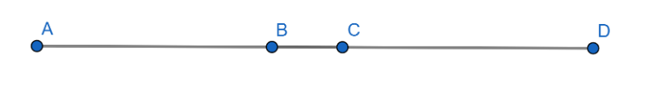
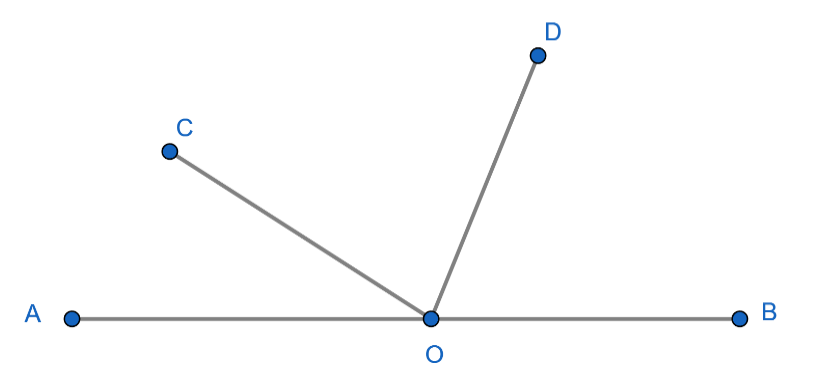
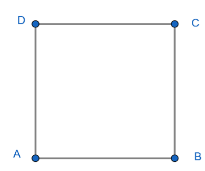
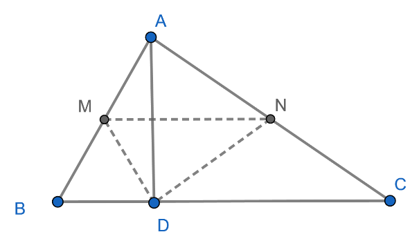
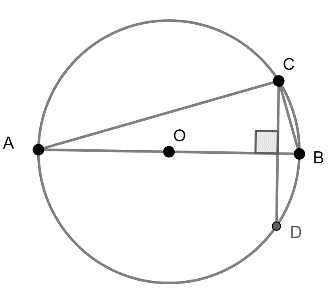
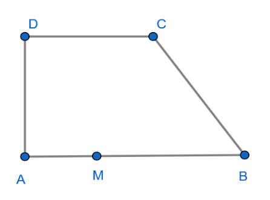
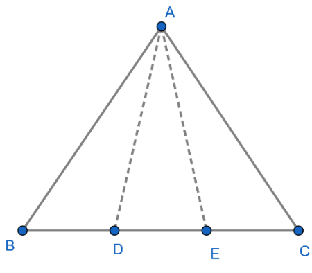
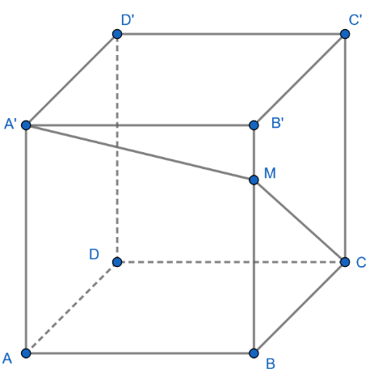

# Subiectul I

## 1. 5p

Sfertul numărului $2^4$ este:

a. $2$
b. $4$
c. $2^3$
d. $16$

## 2. 5p

Cel mai mic element al mulțimii $A = \{x \in \mathbb{Z}|-2024 < x \leq 10\}$ este:

a. $-2021$
b. $-2023$
c. $-2022$
d. $10$

## 3. 5p

Dacă $\frac{a}{3} = \frac{b}{4}$, atunci $8a - 6b$ este:

a. $3$
b. $4$
c. $0$
d. $1$

## 4. 5p

Se consideră numerele $a = 2 - \sqrt{3}$ și $b = 2 + \sqrt{3}$. Media aritmetică a numerelor $a, b$ și $8$ este:

a. $2$
b. $3$
c. $3\sqrt{3}$
d. $4$

## 5. 5p

Un obiect costă 200 lei. Afirmația: „După o scumpire de 15% prețul obiectului va fi 215 lei.” este:

a. adevărată
b. falsă

## 6. 5p

În tabelul de mai jos sunt temperaturile medii înregistrate pe parcursul unei săptămâni:

$\begin{array}{|c|c|c|c|c|c|c|c|}
\hline
\text{ziua} & \text{Luni} & \text{Marți} & \text{Miercuri} & \text{Joi} & \text{Vineri} & \text{Sâmbătă} & \text{Duminică} \\
\hline
\text{Temperatura medie} & -3^\circ C & -2^\circ C & -1^\circ C & 1^\circ C & 2^\circ C & -1^\circ C & -3^\circ C \\
\hline
\end{array}$

Temperatura medie în acea săptămână a fost de:

a. $1^\circ C$
b. $-1^\circ C$
c. $0^\circ C$
d. $-7^\circ C$

# Subiectul al II-lea

## 1. 5p

În figura alăturată punctele $A, B, C$ și $D$ sunt coliniare, în această ordine, $C$ este mijlocul segmentului $AD$ și $AB = 3 \cdot BC$. Dacă lungimea segmentului $AD$ este egală cu 16 cm, atunci lungimea segmentului $BC$ este egală cu:

a. $1$ cm
b. $2$ cm
c. $3$ cm
d. $1,5$ cm

## 2. 5p

În figura alăturată, punctele $A, O, B$ sunt coliniare, în această ordine, iar măsura unghiului $COD$ este egală cu $100^\circ$. Măsura unghiului format de bisectoarele unghiurilor $AOC$ și $BOD$ este egală cu:

a. $100^\circ$
b. $130^\circ$
c. $140^\circ$
d. $120^\circ$

## 3. 5p

Pătratul $ABCD$ are lungimea diagonalei $AC$ egală cu 6 cm. Perimetrul pătratului $ABCD$ este egal cu:

a. $18$ cm
b. $15\sqrt{5}$ cm
c. $12\sqrt{2}$ cm
d. $15\sqrt{3}$ cm

## 4. 5p

Triunghiul $ABC$ are perimetrul egal cu 40 cm. Fie $M$ și $N$ mijloacele laturilor $AB$, respectiv $AC$, iar punctul $D$ este proiecția punctului $A$ pe dreapta $BC$. Perimetrul triunghiului $MND$ este egal cu:

a. $20$ cm
b. $30$ cm
c. $10$ cm
d. $15$ cm

## 5. 5p

Fie $AB$ diametrul în cercul de centru $O$ și rază de lungime egală cu 5 cm. Dacă $CD \perp AB$ și lungimea segmentului $AC$ este egală cu 8 cm, atunci aria patrulaterului $ACBD$ este egală cu:

a. $24$ cm²
b. $25$ cm²
c. $20$ cm²
d. $48$ cm²

## 6. 5p

Aria bazei unui tetraedru regulat este egală cu $9\sqrt{3}$ cm². Suma lungimilor muchiilor laterale este egală cu:

a. $16\sqrt{3}$ cm
b. $30$ cm
c. $12$ cm
d. $18$ cm

# Subiectul al III-lea

## 1. 5p

Prețul unui obiect este egal cu 2000 lei și se micșorează cu 20%. După un timp, același obiect se ieftinește din nou cu 20%.

### a. 3p

Aflați cât costă obiectul după cele două ieftiniri.

### b. 2p

Cu ce procent ar trebui să se ieftinească obiectul, o singură dată, astfel ca prețul acestuia să fie egal cu 1280 lei?

## 2. 5p

Fie $x = \sqrt{144} + 2\sqrt{18} - (\sqrt{3})^2$

### a. 2p

Arătați că $x = 9 + 6\sqrt{2}$;

### b. 3p

Determinați numărul pozitiv $y$ pentru care media geometrică a numerelor $x$ și $y$ este $\sqrt{{36} + 27\sqrt{2}}$.

## 3. 5p

Se consideră mulțimile $A = \{x \in \mathbb{R} ||x + 2| \leq 3\}$ și $B = \{x \in \mathbb{R} | 1 < \frac{3x + 8}{2} \leq 13\}$.

### a. 2p

Arătați că $A = [-5, 1]$;

### b. 3p

Determinați $(A \cap B) \cap \mathbb{Z}$.

## 4. 5p

În figura alăturată, $ABCD$ este un trapez dreptunghic cu $AB = 8$ cm, $BC = CD = 5$ cm.

### a. 2p

Arătați că aria trapezului $ABCD$ este egală cu 26 cm²;

### b. 3p

Dacă punctul $M$ aparține segmentului $AB$ astfel încât lungimea segmentului $AM$ este egală cu 3 cm, arătați că $CM \perp BD$.

## 5. 5p

Se consideră triunghiul echilateral $ABC$. Punctele $D$ și $E$ sunt situate pe latura $BC$, astfel încât $BD = DE = EC = 6$ cm.

### a. 2p

Arătați că perimetrul triunghiului $ABC$ este egal cu 54 cm;

### b. 3p

Calculați sinusul unghiului $\angle DAE$.

## 6. 5p

În paralelipipedul dreptunghic $ABCD A'B'C'D'$, cu diagonala $AC'$ de 100 cm, avem $AB = 64$ cm, $BC = 48$ cm, $AA' = 60$ cm, iar $M$ este un punct pe muchia $BB'$.

### a. 2p

Arătați că triunghiul $A'BC$ este dreptunghic;

### b. 3p

Arătați că valoarea perimetrului triunghiului $A'MC$ nu poate fi mai mică de 227 cm.
