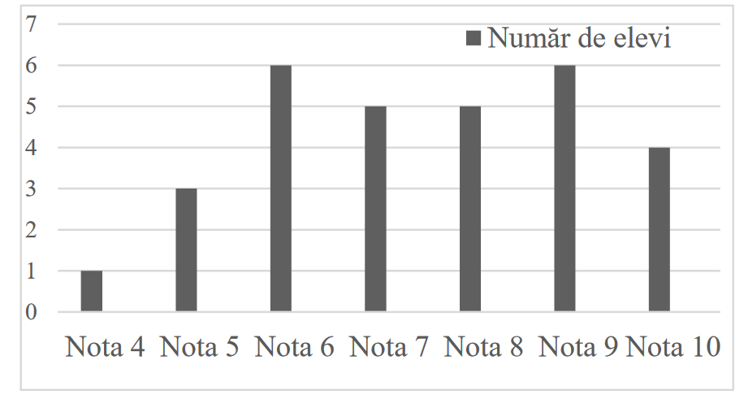
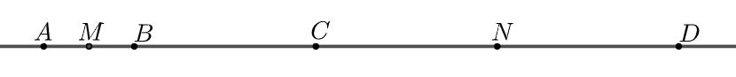
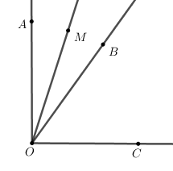
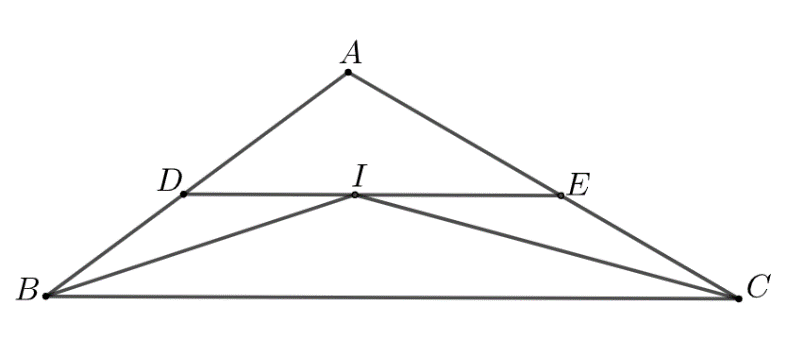
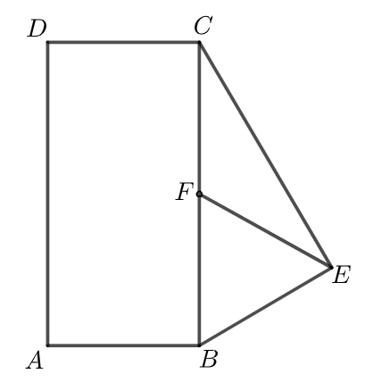
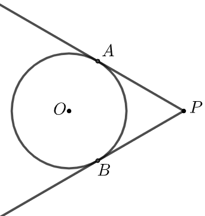
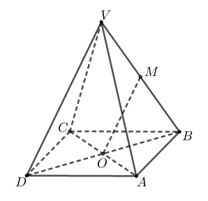
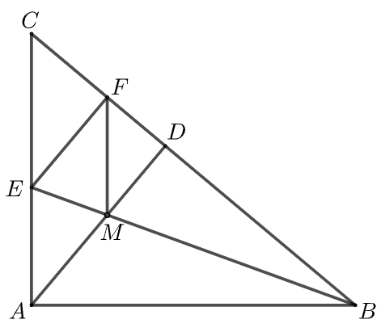
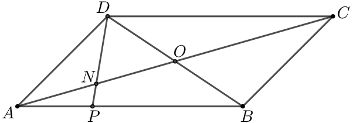
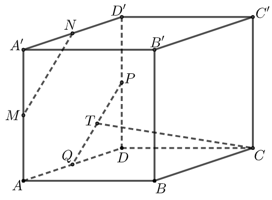

# Subiectul I

## 1. 5p

Rezultatul calculului $52 - 2 \cdot (25 - 5)$ este:

a. $12$
b. $92$
c. $100$
d. $1000$

## 2. 5p

Dacă $\frac{x - 2}{5} = \frac{y}{3}$, atunci rezultatul calculului $3x - 5y$ este:

a. $0$
b. $2$
c. $5$
d. $6$

## 3. 5p

Se consideră mulțimile $A = \{1, 2, 3, 4, 5, 6\}$ și $B = \{0, 2, 4, 6, 8\}$. Intersecția mulțimilor $A$ și $B$ este mulțimea:

a. $\{0, 2, 4, 6, 8\}$
b. $\{0, 1, 2, 3, 4, 5, 6, 8\}$
c. $\{2, 4, 6\}$
d. $\{0, 2, 4, 6\}$

## 4. 5p

Mulțimea soluțiilor reale ale inecuației $2x + 2 \geq 4$ este:

a. $(-\infty, -1]$
b. $(-\infty, 1]$
c. $[-1, +\infty)$
d. $[1, +\infty)$

## 5. 5p

Patru elevi, Ana, Ioan, Dana și Vlad determină numărul $a = 2 - 4\sqrt{3} + 2(\sqrt{12} + 1)$. Rezultatele obținute de cei patru elevi sunt prezentate în tabelul de mai jos:

$\begin{array}{|c|c|c|c|}
\hline
\text{Ana} & \text{Ioan} & \text{Dana} & \text{Vlad} \\
\hline
\ 0 & 4 & 4\sqrt{3} & 8\sqrt{3} \\
\hline
\end{array}$

Conform informațiilor din tabel, elevul care a determinat corect numărul $a$ este:

a. Ana
b. Ioan
c. Dana
d. Vlad

## 6. 5p

În diagrama de mai jos sunt prezentate rezultatele obținute de elevii unei clase, la un test de matematică.

Afirmația: „Conform informațiilor din diagramă, jumătate din numărul elevilor acestei clase a obținut la testul de matematică cel puțin nota 8.” este:

a. adevărată
b. falsă

# Subiectul al II-lea

## 1. 5p

În figura alăturată punctele $A$, $B$, $C$, $D$ sunt coliniare, în această ordine, astfel încât $BC = 2AB$, $CD = 2BC$ și $AB = 2$ cm. Punctul $M$ este mijlocul segmentului $AB$ și punctul $N$ este mijlocul segmentului $CD$. Lungimea segmentului $MN$ este egală cu:

a. $4$ cm
b. $5$ cm
c. $7$ cm
d. $9$ cm

## 2. 5p

În figura alăturată sunt reprezentate unghiurile adiacente complementare $AOB$ și $BOC$. Semidreapta $OM$ este bisectoarea unghiului $AOB$ și $ \angle BOC = 3 \cdot\angle AOM$. Măsura unghiului $AOB$ este egală cu:

a. $18^\circ$
b. $36^\circ$
c. $40^\circ$
d. $54^\circ$

## 3. 5p

În figura alăturată este reprezentat triunghiul $ABC$ cu $AB = 10$ cm și $AC = 12$ cm. Semidreapta $BI$ este bisectoarea unghiului $ACB$ și semidreapta $CI$ este bisectoarea unghiului $ACB$. Paralela prin punctul $I$ la dreapta $BC$ intersectează dreptele $AB$ și $AC$ în punctele $D$, respectiv $E$. Perimetrul triunghiului $ADE$ este egal cu:

a. $11$ cm
b. $20$ cm
c. $22$ cm
d. $24$ cm

## 4. 5p

În figura alăturată este reprezentat dreptunghiul $ABCD$, cu $AB = 3\sqrt{2}$ cm și triunghiul $BEC$ dreptunghic în $E$. Punctul $F$ este mijlocul segmentului $BC$ și $EF = 4$ cm. Aria trapezului $AFCD$ este egală cu:

a. $6\sqrt{2}$ cm²
b. $12\sqrt{2}$ cm²
c. $18\sqrt{2}$ cm²
d. $24\sqrt{2}$ cm²

## 5. 5p

În figura alăturată este reprezentat cercul cu centrul în punctul $O$ și raza egală cu $3$ cm. Punctul $P$ este situat la o distanță de $6$ cm de centrul cercului. Dreptele $PA$ și $PB$ sunt tangente la cerc în punctele $A$ și $B$. Măsura arcului mic $AB$ este egală cu:

a. $60^\circ$
b. $90^\circ$
c. $120^\circ$
d. $150^\circ$

## 6. 5p

În figura alăturată este reprezentată piramida patrulateră regulată $VABCD$ cu baza $ABCD$, $VA = 4B$ și $O$ este punctul de intersecție a dreptelor $AC$ și $BD$. Dacă punctul $M$ este mijlocul segmentului $VB$, atunci măsura unghiului dreptelor $OM$ și $CD$ este egală cu:

a. $0^\circ$
b. $30^\circ$
c. $45^\circ$
d. $60^\circ$

# Subiectul al III-lea

## 1. 5p

Maria aranjează cărțile din bibliotecă și observă că dacă le grupează câte 8, câte 12 sau câte 18 îi rămân de fiecare dată 5 cărți.

### a. 2p

Verifică dacă Maria poate avea în bibliotecă 53 de cărți. Justifică răspunsul dat.

### b. 3p

Determină numărul cărților din biblioteca Mariei, știind că acesta este cel mai mic număr natural de trei cifre cu proprietățile din enunț.

## 2. 5p

Se consideră expresia $E(x) = (2x + 3)^2 + (x - 2)(x + 2) - 3(1 - x) + 2$, unde $x$ este număr real.

### a. 2p

Arată că $E(0) = 4$.

### b. 3p

Arată că numărul $N = E(n) + 6$ este divizibil cu 10, pentru orice număr natural $n$.

## 3. 5p

Se consideră numărul natural $abc$ cu $a, b, c$ cifre nenule, unde $a = \ 5 \left( \frac{1}{3} + \frac{1}{6} + \frac{1}{6} \right) -  \frac{2}{3} : \frac {1}{3}$ și $b = (3 \cdot 3^2 \cdot 3^3 \cdot 3^4) : 9^4 - 25^4 : 5^7$.

### a. 2p

Arată că $a = 3$.

### b. 3p

Determină numărul $abc$, știind că numerele $ac$ și $cb$ sunt direct proporționale cu numerele 4 și 3.

## 4. 5p

În figura alăturată este reprezentat triunghiul dreptunghic $ABC$, cu $\angle A = 90^\circ$ și $\angle B = 40^\circ$. Semidreapta $BE$ este bisectoarea unghiului $ABC$, punctul $E$ aparține segmentului $AC$. Perpendiculara din punctul $A$ pe $BC$ intersectează dreapta $BC$ în punctul $D$, iar perpendiculara din punctul $E$ pe $BC$ intersectează dreapta $BC$ în punctul $F$. Dreptele $BE$ și $AD$ se intersectează în punctul $M$.

### a. 2p

Arată că măsura unghiului $EMA$ este egală cu $70^\circ$.

### b. 3p

Arată că patrulaterul $AMFE$ este romb.

## 5. 5p

În figura alăturată este reprezentat paralelogramul $ABCD$ cu $AB = 15$ cm. Punctul $P$ aparține laturii $AB$, astfel încât $PB = 2AP$ și $O$ este punctul de intersecție a dreptelor $AC$ și $BD$.

### a. 2p

Arată că lungimea segmentului $AP$ este egală cu 5 cm.

### b. 3p

Determină raportul dintre aria triunghiului $ANP$ și aria triunghiului $DNO$, unde $N$ este punctul de intersecție a dreptelor $AC$ și $DP$.

## 6. 5p

În figura alăturată este reprezentat cubul $ABCD A'B'C'D'$. Punctele $M$, $N$, $P$ și $Q$ sunt mijloacele segmentelor $AA'$, $A'D'$, $DD'$, respectiv $AD$.

### a. 2p

Arată că $MN = PQ$.

### b. 3p

Știind că punctul $T$ este mijlocul segmentului $PQ$, demonstrează că dreapta $CT$ este paralelă cu planul $(MNB)$.
