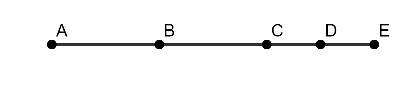
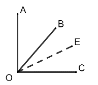
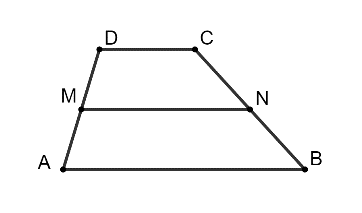
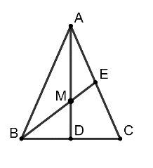
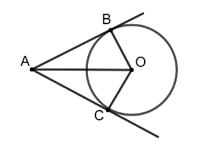
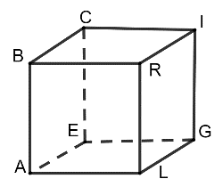
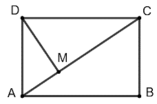
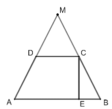
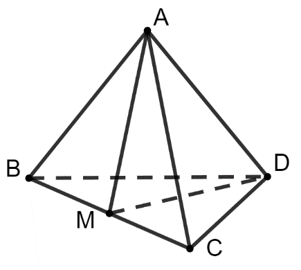

# Subiectul I

## 1. 5p

Se dă mulțimea $A = \left\{ (-3)^2, -\left(\frac{1}{4}\right)^{-2}, \left(\frac{1}{2}\right)^{-1}, -\frac{6}{-2}, \sqrt[3]{\frac{75}{\sqrt[4]{48}}}, \sqrt{5}, \sqrt{0,09} \right\}$. Mulțimea $A \cap \mathbb{N}$ este egală cu:

a. $\tiny \left\{ (-3)^2, (-2)^3, -\frac{6}{-2} \right\}$
b. $\tiny \left\{ (-3)^2, \left(-\frac{1}{2}\right)^3, -\frac{6}{-2} \right\}$
c. $\tiny \left\{ (-3)^2, \left(\frac{1}{2}\right)^{-1}, -\frac{6}{-2} \right\}$
d. $\tiny \left\{ (-3)^2, -\frac{6}{-2} \right\}$

## 2. 5p

Prețul unui obiect este 1200 lei. Dacă prețul obiectului se mărește cu 20%, noul preț este egal cu:

a. 240 lei
b. 960 lei
c. 1224 lei
d. 1440 lei

## 3. 5p

Dacă $\frac{a}{9} = \frac{4}{b}$, atunci media geometrică a numerelor $a$ și $b$ este egală cu:

a. $\sqrt{13}$
b. $6$
c. $6,5$
d. $36$

## 4. 5p

Rezultatul calculului $2(3x+1)-3(-2x-1)-5$ este egal cu:

a. $12x$
b. $12x-6$
c. $0$
d. $-6$

## 5. 5p

Probabilitatea ca aruncând un zar să se obțină un număr par este egală cu:

a. $\frac{1}{6}$
b. $\frac{1}{3}$
c. $\frac{1}{2}$
d. $2$

## 6. 5p

Suma numerelor prime de o cifră este egală cu:

a. $17$
b. $18$
c. $26$
d. $27$

# Subiectul al II-lea

## 1. 5p

În figura alăturată sunt reprezentate punctele $A, B, C, D$ și $E$ astfel încât $B$ este mijlocul segmentului $AC$ și $D$ este mijlocul segmentului $CE$. Dacă $BD = 6$ cm, atunci lungimea segmentului $AE$ este egală cu:

a. $9$ cm
b. $10$ cm
c. $12$ cm
d. $18$ cm

## 2. 5p

În figura alăturată, unghiurile $\angle AOB$ și $\angle BOC$ sunt adiacente și complementare, iar $OE$ este bisectoarea unghiului $BOC$. Știind că măsura unghiului $AOB$ este egală cu $40^\circ$, atunci măsura unghiului $AOE$ este egală cu:

a. $25^\circ$
b. $50^\circ$
c. $60^\circ$
d. $65^\circ$

## 3. 5p

În figura alăturată este reprezentat un trapez $ABCD$, cu $AB \parallel CD$, iar punctele $M$ și $N$ sunt mijloacele segmentelor $AD$ și $BC$. Se știe că $CD = 4$ cm și $MN = 8$ cm. Lungimea segmentului $AB$ este egală cu:

a. $6$ cm
b. $12$ cm
c. $16$ cm
d. $24$ cm

## 4. 5p

În figura alăturată este reprezentat triunghiul $ABC$ isoscel, de bază $BC$, în care s-au construit înălțimea $AD$ și mediana $BE$. Dacă $AB = 10$ cm, $BC = 16$ cm, iar $AD \cap BE = \{M\}$, atunci lungimea segmentului $MD$ este egală cu:

a. $2$ cm
b. $3$ cm
c. $4$ cm
d. $6$ cm

## 5. 5p

În figura alăturată este reprezentat cercul de centru $O$ și rază $6$ cm. Fie punctul $A$ exterior cercului, iar $AB$ și $AC$ tangente cercului în punctele $B$ și $C$. Știind că $AO = 10$ cm, atunci perimetrul patrulaterului $ABOC$ este egal cu:

a. $22$ cm
b. $26$ cm
c. $28$ cm
d. $48$ cm

## 6. 5p

În figura alăturată este reprezentat cubul $ALGEBRIC$. Un exemplu de două muchii necoplanare este:

a. $LG$ și $BC$
b. $CE$ și $LR$
c. $BR$ și $BC$
d. $LR$ și $EG$

# Subiectul al III-lea

## 1. 5p

Suma a două numere naturale este egală cu 150, iar raportul dintre primul număr micșorat cu 8 și al doilea număr mărit cu 12 are valoarea 1.

### a. 2p

Este posibil ca cele două numere să fie egale? Justifică răspunsul dat.

### b. 3p

Determină cele două numere.

## 2. 5p

Fie mulțimile $A = \left\{ x \in \mathbb{R} | |2x - 1| \leq 7 \right\}$ și $B = \left\{ x \in \mathbb{R} | \frac{1}{5} \leq 3x + 2 < 4 \right\}$.

### a. 2p

Arată că mulțimea $A = [-3;4]$.

### b. 3p

Calculează mulțimea $C$, unde $C = A \cap B$.

## 3. 5p

Fie numerele $a = (\frac{18}{\sqrt{50}} - \frac{10}{\sqrt{18}})\cdot 30$ și $b = \sqrt{20^2 - 16^2} - \frac{1}{4\sqrt{3}}$.

### a. 2p

Arată că $a = 4\sqrt{2}$.

### b. 3p

Arată că $a\sqrt{2} - b\sqrt{3}$ este număr prim.

## 4. 5p

În figura alăturată este reprezentat dreptunghiul $ABCD$, cu $AD = 15$ cm și $AC = 25$ cm și $DM$ perpendiculară pe $AC$.

### a. 2p

Arată că perimetrul dreptunghiului $ABCD$ este egal cu 70 cm.

### b. 3p

Arată că tangenta unghiului $MDC$ este egală cu $\frac{4}{3}$.

## 5. 5p

În figura alăturată este reprezentat trapezul isoscel $ABCD$, cu $AB \parallel CD$, $AB > CD$, $AB = 24$ cm, $CD = 8$ cm și înălțimea $CE = 8\sqrt{2}$ cm. Fie $AD \cap CB = \{M\}$.

### a. 2p

Arată că aria trapezului $ABCD$ este $128\sqrt{2}$ cm².

### b. 3p

Calculează perimetrul triunghiului $AMB$.

## 6. 5p

În figura alăturată este reprezentat tetraedrul regulat $ABCD$ cu $AB = 6\sqrt{3}$ cm. Se notează cu $M$ mijlocul segmentului $BC$.

### a. 2p

Calculează suma tuturor muchiilor tetraedrului $ABCD$.

### b. 3p

Calculează aria triunghiului $AMD$.
